## Chapter Title
Harnessing single cell RNA sequencing to identify dendritic cell types, characterize their biological states and infer their activation trajectory

### Data description


### Setting up the environment for performing the Analyses:

* In order to run the analysis, several files need to be downloaded: 
* 4 input files: 
  + the 2 pre-processed scRNAseq data (one file for naïve and one file for tumor-bearing lungs), 
  + the 2 metadata files containing ADT (Antibody-Derived Tags) informations. 
  +  Although not mandatory, we provide a Docker image in order to simplify the reproduction of our analysis. 
  +  2 signature files.
  +  Immgen phase 1 ? 
 
### Download the input files:

Download the expression and metadata files from mouse CD45+ Lin- MHCII+ CD11c+ cells isolated from normal or tumor-bearing lungs (PMID: 32269339), encompassing type 1 conventional dendritic cells (cDC1s), from the Gene Expression Omnibus (GEO) website.
The GEO accession number is GSE131957: https://www.ncbi.nlm.nih.gov/geo/query/acc.cgi?acc=GSE131957
Linux and Mac users can type the following command in the Terminal (See Note 8). 


```r
wget https://ftp.ncbi.nlm.nih.gov/geo/samples/GSM3832nnn/GSM3832735/suppl/GSM3832735_wt_naive_gex.csv.gz
wget https://ftp.ncbi.nlm.nih.gov/geo/samples/GSM3832nnn/GSM3832736/suppl/GSM3832736_wt_naive_adt.csv.gz
wget https://ftp.ncbi.nlm.nih.gov/geo/samples/GSM3832nnn/GSM3832737/suppl/GSM3832737_wt_tumor_gex.csv.gz
wget https://ftp.ncbi.nlm.nih.gov/geo/samples/GSM3832nnn/GSM3832738/suppl/GSM3832738_wt_tumor_adt.csv.gz
```
(See Note 8)

* Uncompress these files
 

```r
gunzip GSM3832735_wt_naive_gex.csv.gz
gunzip GSM3832736_wt_naive_adt.csv.gz
gunzip GSM3832737_wt_tumor_gex.csv.gz
gunzip GSM3832738_wt_tumor_adt.csv.gz
```
* Download from Immgen the Microarray Phase 1 normalized dataset (reference).


```r
wget https://sharehost.hms.harvard.edu/immgen/GSE15907/GSE15907_Normalized_Data.csv
```
### Download the Docker file

The easiest way to reproduce this workflow is to load and run the Docker image that we provide (see below how to use them). These images were generated in Linux and can be loaded directly by Linux and Mac users, after having installed Docker (https://docs.docker.com/get-docker/). Windows users can theoretically use these images (add link here). 
However, if for any reason, Docker can not be installed/used, an alternative solution is to download each software/package (described below) independently. 

* Procedure to load the Docker image:

Download the Docker images from this link (Zenodo link), load the image: 


```r
docker load -i /path_to_Docker_image/MDAlab_cDC1_maturation.tar
```

Run the docker container from the docker image (Linux and Mac users):


```r
docker run --name DC1_maturation -d -p 8181:8787 -v /home/$USER:/home/$USER/ -e USER=$(whoami) -e USERID=$(id -u) -e GROUPID=$(id -g) -e PASSWORD=<your_password> -t MDAlab_cDC1_maturation.tar
```
(See Note 9)

* For using this container on local computer, type in a browser address bar:


```r
localhost:8181
```
Or for using this docker on a remote server, type in a browser address bar: 


```r
<IP_address_of_the_server>:8181
```
The browser will display a Rstudio screen asking for username and password. Type the session user and the password (<your_password>) provided to run the container. The Rstudio environment will open with all required packages already installed.
* If these Docker files can not be used for any reason, we provide in the next section the programs to be downloaded and installed.

### Programs and packages used in this workflow

This workflow for analyzing scRNAseq data is mostly performed under the R statistical environment, which can be downloaded from http://www.r-project.org. 
We recommend using Rstudio, a set of tools interfacing with R, in order to simplify the usage of R (https://www.rstudio.com/products/rstudio/download/).

### Main R packages used in this book chapter (other R packages are used for dependency reasons but not described here) :

### Seurat

Seurat is a software for performing scRNAseq data analysis. Seurat is used for quality checks, filtering cells and genes, clustering cells and performing dimensionality reduction and visualization. There are other packages for performing single cell rna seq data analysis (See Notes 1). It can be downloaded from https://satijalab.org/seurat/ (PMID: 34062119).

### Scater

As Seurat, Scater is a toolkit for analyzing scRNAseq data. We use Scater in this workflow to calculate the cut-off of mitochondrial gene expression we want to use for filtering cells (http://bioconductor.org/packages/scater) (PMID: 28088763).

### Monocle

Monocle3 investigates cell trajectories and the dynamics of gene expression within these trajectories (https://cole-trapnell-lab.github.io/monocle3/) (PMID: 24658644).

### Velocyto

RNA velocity analysis predicts the future direction in which cells are moving in the transcriptional space by estimating, for each cell, the time derivative of RNA abundance (http://velocyto.org/) (PMID: 30089906).
 

### SeuratWrappers

### ggplot

ggplot is an R package used for data visualization (https://ggplot2.tidyverse.org/)

### EnrichR

enrichR provides an interface to the Enrichr database. It is used to calculate statistical enrichment of functional annotations based on gene lists and gene annotation databases of interest (https://CRAN.R-project.org/package=enrichR) (PMID: 27141961). 
 
* Other software used in this book chapter:
In addition to R, we also use BubbleGUM, a java-based computational tool that allows to automatically extract signatures based on transcriptomic data and to perform multiple Gene Set Enrichment Analysis (GSEA). It is available at http://www.ciml.univ-mrs.fr/applications/BubbleGUM/index.html(PMID: 26481321)

### Running the workflow


### Organize the files

Put all expression and metadata files into a single separate folder, named input_files. In the Console of Rstudio (from the Docker container accessed through the browser), set the working directory to the folder containing the input files:


```r
setwd("<path_to>/input_files/") (See Note 2)
```

### Read input files
* Read the two expression files for naive lungs and for tumor-bearing lungs:

```r
naive_counts <- read.table("GSM3832735_wt_naive_gex.csv", sep=",", header=T, row.names=1)
tumor_counts <- read.table("GSM3832737_wt_tumor_gex.csv", sep=",", header=T, row.names=1)
```
* Merge the two expression files from naive and tumor-bearing lungs:

```r
counts_file <- cbind(naive_counts, tumor_counts)
```
* Read and transpose the metadata file of naive lungs: 


```r
naïve_metadata=read.delim("GSM3832736_wt_naive_adt.csv",sep=",", header=T, row.names=1)
naïve_metadata <- as.data.frame(t(naïve_metadata))
```

* Add information to the cells, in order to keep track of their origin after merging the metadata for naïve and tumor-bearing lungs:


```r
naïve_metadata$type <- "naïve"
```
* Do the same for the metadata file of tumor-bearing lungs: 


```r
tumor_metadata=read.delim("GSM3832738_wt_tumor_adt.csv",sep=",", header=T, row.names=1)
tumor_metadata <- as.data.frame(t(tumor_metadata))
tumor_metadata$type <- "tumor"
```

* Merge both metadata files:


```r
metadata <- rbind(naïve_metadata, tumor_metadata)
```
Check if cell names are same in both gene expression and metadata files


```r
all(colnames(counts_file)==rownames(metadata))
```

```
## [1] TRUE
```

### Install and load required Packages

The following command line is not necessary with our Docker container:


```r
install.packages(c("Seurat", "scater", "enrichR" ,"ggplot2" ,"devtools","dplyr","reshape","VGAM",
"igraph","cowplot","velocyto.R","SeuratWrappers"))
```

* For packages which are installed using github


```r
install_github(c('cole-trapnell-lab/leidenbase','cole-trapnell-lab/monocle3'))
```
* Load the packages (also when using our docker container)


```r
required_packages <- c("Seurat", "scater", "enrichR" ,  "ggplot2", "devtools", "dplyr", "reshape", "VGAM", "igraph", "cowplot", "monocle3","velocyto.R","SeuratWrappers")
lapply(required_packages, require, character.only = TRUE)
```

```
## Loading required package: Seurat
```

```
## Attaching SeuratObject
```

```
## Loading required package: scater
```

```
## Loading required package: SingleCellExperiment
```

```
## Loading required package: SummarizedExperiment
```

```
## Loading required package: MatrixGenerics
```

```
## Loading required package: matrixStats
```

```
## 
## Attaching package: 'MatrixGenerics'
```

```
## The following objects are masked from 'package:matrixStats':
## 
##     colAlls, colAnyNAs, colAnys, colAvgsPerRowSet, colCollapse,
##     colCounts, colCummaxs, colCummins, colCumprods, colCumsums,
##     colDiffs, colIQRDiffs, colIQRs, colLogSumExps, colMadDiffs,
##     colMads, colMaxs, colMeans2, colMedians, colMins, colOrderStats,
##     colProds, colQuantiles, colRanges, colRanks, colSdDiffs, colSds,
##     colSums2, colTabulates, colVarDiffs, colVars, colWeightedMads,
##     colWeightedMeans, colWeightedMedians, colWeightedSds,
##     colWeightedVars, rowAlls, rowAnyNAs, rowAnys, rowAvgsPerColSet,
##     rowCollapse, rowCounts, rowCummaxs, rowCummins, rowCumprods,
##     rowCumsums, rowDiffs, rowIQRDiffs, rowIQRs, rowLogSumExps,
##     rowMadDiffs, rowMads, rowMaxs, rowMeans2, rowMedians, rowMins,
##     rowOrderStats, rowProds, rowQuantiles, rowRanges, rowRanks,
##     rowSdDiffs, rowSds, rowSums2, rowTabulates, rowVarDiffs, rowVars,
##     rowWeightedMads, rowWeightedMeans, rowWeightedMedians,
##     rowWeightedSds, rowWeightedVars
```

```
## Loading required package: GenomicRanges
```

```
## Loading required package: stats4
```

```
## Loading required package: BiocGenerics
```

```
## Loading required package: parallel
```

```
## 
## Attaching package: 'BiocGenerics'
```

```
## The following objects are masked from 'package:parallel':
## 
##     clusterApply, clusterApplyLB, clusterCall, clusterEvalQ,
##     clusterExport, clusterMap, parApply, parCapply, parLapply,
##     parLapplyLB, parRapply, parSapply, parSapplyLB
```

```
## The following objects are masked from 'package:stats':
## 
##     IQR, mad, sd, var, xtabs
```

```
## The following objects are masked from 'package:base':
## 
##     anyDuplicated, append, as.data.frame, basename, cbind, colnames,
##     dirname, do.call, duplicated, eval, evalq, Filter, Find, get, grep,
##     grepl, intersect, is.unsorted, lapply, Map, mapply, match, mget,
##     order, paste, pmax, pmax.int, pmin, pmin.int, Position, rank,
##     rbind, Reduce, rownames, sapply, setdiff, sort, table, tapply,
##     union, unique, unsplit, which.max, which.min
```

```
## Loading required package: S4Vectors
```

```
## 
## Attaching package: 'S4Vectors'
```

```
## The following object is masked from 'package:base':
## 
##     expand.grid
```

```
## Loading required package: IRanges
```

```
## Loading required package: GenomeInfoDb
```

```
## Loading required package: Biobase
```

```
## Welcome to Bioconductor
## 
##     Vignettes contain introductory material; view with
##     'browseVignettes()'. To cite Bioconductor, see
##     'citation("Biobase")', and for packages 'citation("pkgname")'.
```

```
## 
## Attaching package: 'Biobase'
```

```
## The following object is masked from 'package:MatrixGenerics':
## 
##     rowMedians
```

```
## The following objects are masked from 'package:matrixStats':
## 
##     anyMissing, rowMedians
```

```
## 
## Attaching package: 'SummarizedExperiment'
```

```
## The following object is masked from 'package:SeuratObject':
## 
##     Assays
```

```
## The following object is masked from 'package:Seurat':
## 
##     Assays
```

```
## Loading required package: ggplot2
```

```
## Loading required package: enrichR
```

```
## Welcome to enrichR
## Checking connection ...
```

```
## Enrichr ... Connection is Live!
## FlyEnrichr ... Connection is available!
## WormEnrichr ... Connection is available!
## YeastEnrichr ... Connection is available!
## FishEnrichr ... Connection is available!
## Loading required package: devtools
## Loading required package: usethis
## Registered S3 method overwritten by 'cli':
##   method     from    
##   print.boxx spatstat
## Loading required package: dplyr
## 
## Attaching package: 'dplyr'
## 
## The following object is masked from 'package:Biobase':
## 
##     combine
## 
## The following objects are masked from 'package:GenomicRanges':
## 
##     intersect, setdiff, union
## 
## The following object is masked from 'package:GenomeInfoDb':
## 
##     intersect
## 
## The following objects are masked from 'package:IRanges':
## 
##     collapse, desc, intersect, setdiff, slice, union
## 
## The following objects are masked from 'package:S4Vectors':
## 
##     first, intersect, rename, setdiff, setequal, union
## 
## The following objects are masked from 'package:BiocGenerics':
## 
##     combine, intersect, setdiff, union
## 
## The following object is masked from 'package:matrixStats':
## 
##     count
## 
## The following objects are masked from 'package:stats':
## 
##     filter, lag
## 
## The following objects are masked from 'package:base':
## 
##     intersect, setdiff, setequal, union
## 
## Loading required package: reshape
## 
## Attaching package: 'reshape'
## 
## The following object is masked from 'package:dplyr':
## 
##     rename
## 
## The following objects are masked from 'package:S4Vectors':
## 
##     expand, rename
## 
## Loading required package: VGAM
## Loading required package: splines
## Loading required package: igraph
## 
## Attaching package: 'igraph'
## 
## The following objects are masked from 'package:dplyr':
## 
##     as_data_frame, groups, union
## 
## The following object is masked from 'package:scater':
## 
##     normalize
## 
## The following object is masked from 'package:GenomicRanges':
## 
##     union
## 
## The following object is masked from 'package:IRanges':
## 
##     union
## 
## The following object is masked from 'package:S4Vectors':
## 
##     union
## 
## The following objects are masked from 'package:BiocGenerics':
## 
##     normalize, path, union
## 
## The following objects are masked from 'package:stats':
## 
##     decompose, spectrum
## 
## The following object is masked from 'package:base':
## 
##     union
## 
## Loading required package: cowplot
## 
## Attaching package: 'cowplot'
## 
## The following object is masked from 'package:reshape':
## 
##     stamp
## 
## Loading required package: monocle3
## 
## Attaching package: 'monocle3'
## 
## The following object is masked from 'package:igraph':
## 
##     clusters
## 
## The following objects are masked from 'package:Biobase':
## 
##     exprs, fData, fData<-, pData, pData<-
## 
## Loading required package: velocyto.R
## Loading required package: Matrix
## 
## Attaching package: 'Matrix'
## 
## The following object is masked from 'package:reshape':
## 
##     expand
## 
## The following object is masked from 'package:S4Vectors':
## 
##     expand
## 
## Loading required package: SeuratWrappers
```

```
## [[1]]
## [1] TRUE
## 
## [[2]]
## [1] TRUE
## 
## [[3]]
## [1] TRUE
## 
## [[4]]
## [1] TRUE
## 
## [[5]]
## [1] TRUE
## 
## [[6]]
## [1] TRUE
## 
## [[7]]
## [1] TRUE
## 
## [[8]]
## [1] TRUE
## 
## [[9]]
## [1] TRUE
## 
## [[10]]
## [1] TRUE
## 
## [[11]]
## [1] TRUE
## 
## [[12]]
## [1] TRUE
## 
## [[13]]
## [1] TRUE
```

* Create the Seurat object, perform some QC and Normalize


```r
GSE131957_data <- CreateSeuratObject(counts_file, min.cells = 5, min.features = 600 , project = "GSE131957")
```

Here, we only consider the genes detected in at least five cells (min.cells = 5) and the cells where at least 600 genes have been detected (min.features = 600).

* Check the number of genes and cells in the dataset


```r
dim(GSE131957_data@assays$RNA)
```

```
## [1] 13876  4695
```

The data contains 13876 genes (rows) and 4695 cells (columns).

* Checking the percentage of mitochondrial genes (See Note 10)
Mitochondrial genes are defined as gene symbols starting with “mt”


```r
mito.genes <- grep("^mt", rownames(GSE131957_data@assays$RNA), value=T)
```

* Calculate, for each cell, the percentage of mitochondrial gene counts to all gene counts: 


```r
GSE131957_data[["percent.mt"]] <- PercentageFeatureSet(GSE131957_data, pattern = "^mt")
```

* Now, we’ll use the Scater package to define which cells we will discard, based on an adaptive threshold. Outlier cells are defined based on the median absolute deviation (MAD) from the median percentage of mitochondrial genes calculated above for each cell. A cell is considered an outlier if this percentage is more than 3 MADs over the median percentage.


```r
discard.mito=isOutlier(GSE131957_data[["percent.mt"]][,1],type="higher")
mito.threshold=min(GSE131957_data[["percent.mt"]][,1][discard.mito])
print(mito.threshold)
```

```
## [1] 4.56621
```

The calculated percentage threshold is 4.56621.

* Make violin plots of the Seurat object to look at data distribution and eventually see if there exists any abnormality in the dataset


```r
VlnPlot(GSE131957_data, features = c("nFeature_RNA", "nCount_RNA", "percent.mt"), pt.size = 0.1, ncol = 3)
```

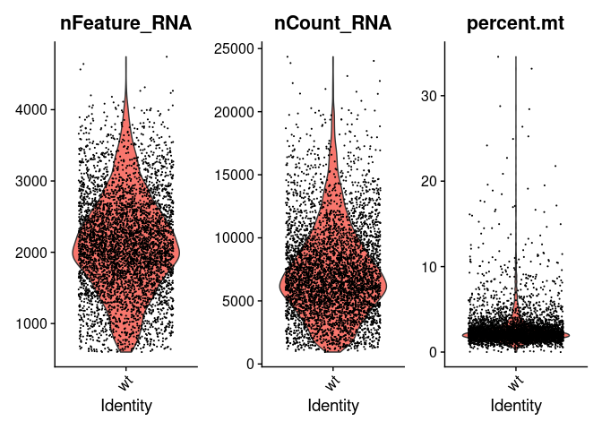<!-- -->

* Plot the distribution of the number of reads per cell


```r
hist(GSE131957_data@meta.data$nCount_RNA)
```

<!-- -->

* Plot the distribution of the number of genes per cell


```r
hist(GSE131957_data@meta.data$nFeature_RNA)
```

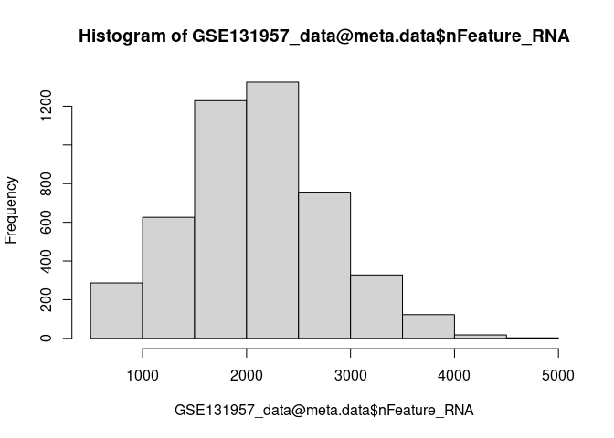<!-- -->

* One can also evaluate the correlation between two measurements: 


```r
FeatureScatter(GSE131957_data, feature1 = "nFeature_RNA", feature2 = "percent.mt")
```

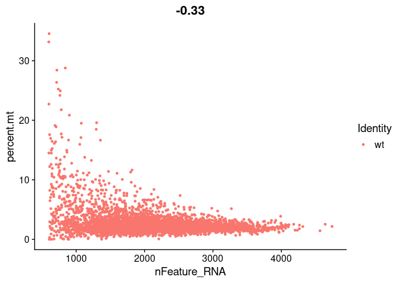<!-- -->

The plot shows no abnormality in the distribution of gene numbers, read numbers nor the percentage of mitochondrial gene expression. The low quality cells (high percentage of mitochondrial gene expression) are also the cells expressing low numbers of genes. 

* We then filter the dataset in order to remove low-quality cells, based on different criteria, including the number of genes and the percentage of mitochondrial gene expression: 


```r
GSE131957_data <- subset(GSE131957_data, subset = nFeature_RNA > 500 & nFeature_RNA < 4500 & percent.mt < mito.threshold)
dim(GSE131957_data)
```

```
## [1] 13876  4297
```

Here we keep the cells displaying at minimum 500 genes, at maximum 4500 genes (above, we could have “doublets”), and a percentage of mitochondrial gene expression below 4.56621. The newly filtered dataset corresponds to 4297 cells. 

* We adjust the metadata accordingly: 


```r
metadata = metadata[rownames(metadata) %in% colnames(GSE131957_data), , drop=F]
```

* We then normalize the data (See Note 11):


```r
GSE131957_data <- NormalizeData(object = GSE131957_data, scale.factor = 1e6)
```

* The most variable genes, that bear the maximum information regarding the differences between cells, are then selected for downstream analysis (See Note 13):


```r
GSE131957_data <- FindVariableFeatures(object= GSE131957_data, nfeatures = 1000)
```
where 
+ nfeatures is the number of genes which are selected as the most variable.


* Identify the 40 most highly variable genes

```r
top40 <- head(VariableFeatures(GSE131957_data), 40)
```

* Plot variable features with and without labels


```r
plot1 <- VariableFeaturePlot(GSE131957_data)
```

* In plot2 label the plot1 with top40 variable genes we have detected above


```r
plot2 <- LabelPoints(plot = plot1, points = top40, repel = TRUE)
```

```
## When using repel, set xnudge and ynudge to 0 for optimal results
```

```r
plot2
```

```
## Warning: ggrepel: 12 unlabeled data points (too many overlaps). Consider
## increasing max.overlaps
```

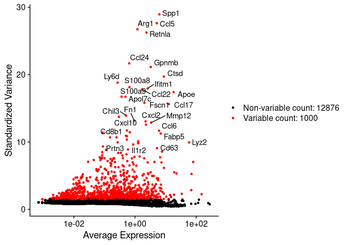<!-- -->


* In order to perform a linear dimensionality reduction, such as Principal Component Analysis (PCA), we need to center and scale the data (See Note 12):


```r
all.genes <- rownames(GSE131957_data)
GSE131957_data <- ScaleData(GSE131957_data, features = all.genes)
```

```
## Centering and scaling data matrix
```

### Dimensionality reductions and clustering
Because scRNAseq datasets contain a large number of measurements, it is necessary to transform these high dimensional data into a low-dimensional space with minimal loss of information , in order to improve classification (clustering) performance and to facilitate manipulation due to computational limitations.

### Linear Dimensionality Reduction 
Principal component analysis (PCA) is the most commonly used dimensionality reduction method. It transforms the data to a new coordinate system where the scalar projection associated with the maximum variance of the data corresponds to the first coordinate, also called first principal component (PC).  

* Run the PCA:


```r
GSE131957_data <- RunPCA(GSE131957_data, features = VariableFeatures(object = GSE131957_data))
```

```
## PC_ 1 
## Positive:  Cst3, Xcr1, Ckb, Sept3, Tnni2, Cd24a, Tlr3, Itgae, Gcsam, Cxx1a 
## 	   Ifi205, Cxx1b, Clec9a, Ffar4, Xlr, Cadm1, Fcrla, Klrd1, Actb, Sult1a1 
## 	   Cxcr3, Id2, Plpp1, Pglyrp1, Hspa1a, Kif23, H2-Oa, 2810417H13Rik, Cd207, Top2a 
## Negative:  Fth1, Ftl1, Cebpb, Trem2, Ctss, Ctsd, Fcgr3, Clec4n, Ctsl, Lilrb4a 
## 	   Pld3, Apoe, Plaur, Lamp1, Ctsa, Pla2g7, Acp5, Capg, Cd63, Lgmn 
## 	   C1qb, Hebp1, Gpnmb, Syngr1, Lilr4b, F10, Mgst1, C1qc, Slc7a11, Cd14 
## PC_ 2 
## Positive:  Top2a, 2810417H13Rik, Ccna2, Nusap1, Spc24, Birc5, Rrm2, Cdca3, Mki67, Asf1b 
## 	   Pbk, Prc1, Kif22, Cenpf, Tk1, Cdk1, Spc25, Cdca8, Ube2c, Casc5 
## 	   Kif11, Stmn1, Aurkb, Fbxo5, Ndc80, Smc2, Ckap2l, Tacc3, Mxd3, Hmmr 
## Negative:  Cacnb3, Ccr7, Nudt17, Il4i1, Fscn1, Tnfrsf4, Serpinb6b, Mreg, Ccl22, Gm13546 
## 	   Ankrd33b, Eno3, Tmem150c, Cdkn2b, Snn, Il12b, Cst3, Apol7c, Bcl2l14, Serpinb9 
## 	   Stat4, H2-Eb2, Slco5a1, Arl5c, Cd83, Lad1, Tbc1d4, Samsn1, Ly75, Mir155hg 
## PC_ 3 
## Positive:  Ccr7, Fscn1, Cacnb3, Nudt17, Il4i1, Serpinb6b, Tnfrsf4, Serpinb9, Socs2, Mreg 
## 	   Ccl22, Relb, Gm13546, Tnfrsf9, Samsn1, Ankrd33b, Ccl5, Stat4, Tmem123, Gadd45b 
## 	   Spint2, Tmem150c, Birc2, Lad1, Fam177a, Eno3, Traf1, H2-Eb2, Apol7c, Ramp3 
## Negative:  Psap, Lyz2, Naaa, Trf, Tgfbi, Ckb, Rab7b, Ppt1, Cd68, Fcgr2b 
## 	   Fos, Btg2, Klf2, Jun, Clec4b1, Sepp1, Cd81, Cadm1, Hspa1a, Lmna 
## 	   Clec4a2, Tlr3, Cd36, Xcr1, Phlda1, Hpgd, Sept3, Cxx1a, Cxx1b, Fcer1g 
## PC_ 4 
## Positive:  Irf8, Rab7b, Xcr1, Cd36, Gcsam, Ppt1, Cadm1, Clec9a, Tlr3, Syngr1 
## 	   Ahnak2, Atp6v0d2, Psap, Sgk1, Bhlhe41, Sept3, Gpnmb, Ifi205, Plin2, Id2 
## 	   Cxx1a, Ctsk, Itgae, Cxx1b, Lhfpl2, Fcrla, Cd200r4, Plpp1, Bst1, Cxcr3 
## Negative:  Tmem176b, Tmem176a, S100a4, Mgl2, Cd209a, Ifitm3, Ifitm2, Ms4a6c, Cfp, Tnip3 
## 	   Il1b, Ms4a4c, Emb, S100a6, Socs3, Wfdc17, Clec10a, Cybb, Cd72, Fcer1g 
## 	   Clec4b1, Clec4a2, Ms4a6b, Pou2f2, Ifitm6, Ccl9, Dab2, Hpgd, Pilra, H2-DMb2 
## PC_ 5 
## Positive:  Cd81, Sepp1, Hpgd, Adgre1, Lpl, Tmem176b, C1qc, Tmem176a, C3ar1, Clec4b1 
## 	   H2-M2, Clec4a2, Cx3cr1, Lyz2, Lilra5, Ccl9, Mrc1, Ftl1, Pf4, C1qa 
## 	   C1qb, Anxa3, Clec4a3, Plxdc2, Cd14, Mafb, Nes, Ms4a7, Tmem119, Fcrls 
## Negative:  Atp1b1, Cd8b1, Ly6d, D13Ertd608e, Sla2, Ccr9, Lefty1, Cox6a2, Klk1, Sell 
## 	   Siglech, Mctp2, Ptprcap, Ly6a, Pacsin1, Dntt, Paqr5, Plac8, Mzb1, Gpr171 
## 	   Gm43291, Atp2a1, Cd7, Hsd11b1, Ly6c2, Ccdc162, Lag3, Cdh1, Ldha, Ifitm1
```
* Plot the pca coordinates in various ways


```r
VizDimLoadings(GSE131957_data, dims = 1:2, reduction = "pca")
```

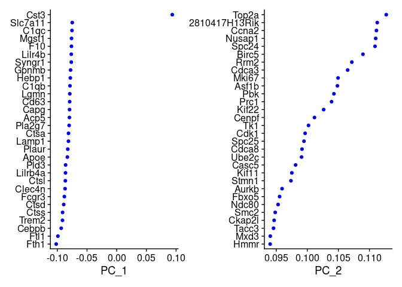<!-- -->

```r
DimPlot(GSE131957_data, dims=c(1, 2), reduction = "pca", pt.size=2)
```

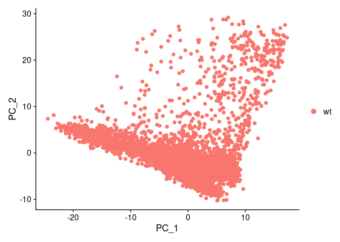<!-- -->

* Plot the heatmaps using the pca information


```r
DimHeatmap(GSE131957_data, dims = 1, cells = 4297, nfeatures = 20, balanced = TRUE)
```

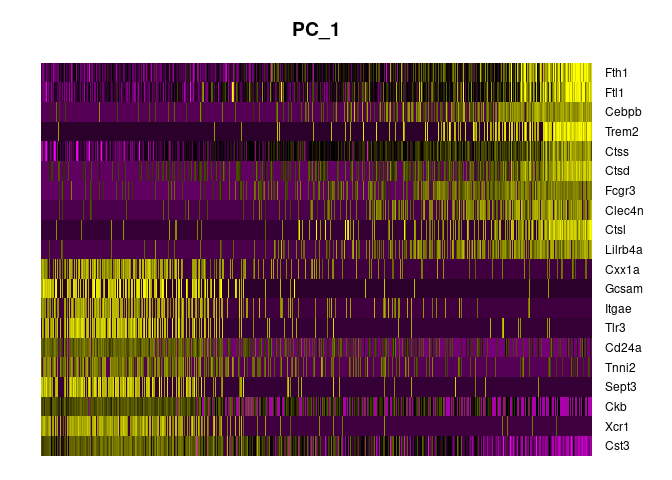<!-- -->

```r
DimHeatmap(GSE131957_data, dims = 1:9, cells = 4297, balanced = TRUE)
```

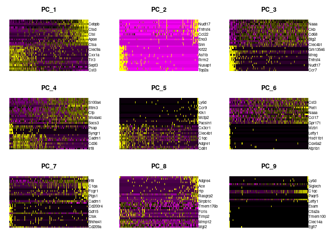<!-- -->


* Plot the standard deviations (SD) of the PCs in order to identify an elbow in the graph. 

The elbow is the shape associated with the point where the SDs stop declining dramatically, and often corresponds well with the significant dimensions. 


```r
ElbowPlot(GSE131957_data)
```

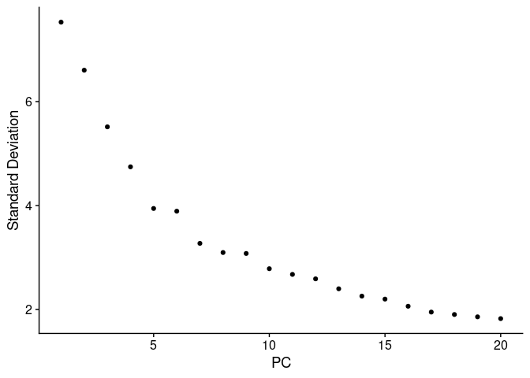<!-- -->

Here, we will retain the first 9 PCs as input for the downstream non-linear dimensionality reduction.

### Clustering 
Clustering in Seurat aims to classify cells into groups displaying similar gene expression patterns, using a shared nearest neighbor (SNN) modularity optimization based clustering algorithm. Cells are embedded in a graph structure where edges are drawn between cells with similar gene expression profiles. The weight of these edges is then refined based on the shared overlap in their local neighborhoods.

* First, construct the k-nearest neighbor (KNN) graph and refine the edge weights between any two cells in order to construct a shared nearest neighbor (SNN) graph:


```r
GSE131957_data <- FindNeighbors( GSE131957_data , reduction = "pca", dims = 1:9, k.param=20)
```

```
## Computing nearest neighbor graph
```

```
## Computing SNN
```

Where 
  +  k.param defines the number of k nearest neighbors, 
  +  reduction the method of dimensionality reduction to be used and 
  +  dims the dimensions to be used as input. 

This command constructs the SNN graph from the knn graph by calculating the neighborhood overlap between every cell and its k.param nearest neighbors. 

* Then, optimize the modularity function to identify cell clusters (See Note 3) (ref:Waltman and van Eck (2013) The European Physical Journal B.):


```r
GSE131957_data <- FindClusters(GSE131957_data, resolution = 0.3, random.seed=0)
```

```
## Modularity Optimizer version 1.3.0 by Ludo Waltman and Nees Jan van Eck
## 
## Number of nodes: 4297
## Number of edges: 139277
## 
## Running Louvain algorithm...
## Maximum modularity in 10 random starts: 0.9248
## Number of communities: 11
## Elapsed time: 0 seconds
```

11 clusters were found in our dataset (See Note 3). 

### Non-linear dimensionality reduction

* Perform a non-linear dimensionality reduction using the most significant PCs as input (See Note 14): 


```r
GSE131957_data <- RunUMAP(GSE131957_data, dims = 1:9, seed.use=10, n.components=2, n.neighbors = 50 )
```

```
## Warning: The default method for RunUMAP has changed from calling Python UMAP via reticulate to the R-native UWOT using the cosine metric
## To use Python UMAP via reticulate, set umap.method to 'umap-learn' and metric to 'correlation'
## This message will be shown once per session
```

```
## 08:17:52 UMAP embedding parameters a = 0.9922 b = 1.112
```

```
## 08:17:52 Read 4297 rows and found 9 numeric columns
```

```
## 08:17:52 Using Annoy for neighbor search, n_neighbors = 50
```

```
## 08:17:52 Building Annoy index with metric = cosine, n_trees = 50
```

```
## 0%   10   20   30   40   50   60   70   80   90   100%
```

```
## [----|----|----|----|----|----|----|----|----|----|
```

```
## **************************************************|
## 08:17:53 Writing NN index file to temp file /tmp/RtmpSEyupg/file62e12583cc1a
## 08:17:53 Searching Annoy index using 1 thread, search_k = 5000
## 08:17:55 Annoy recall = 100%
## 08:17:56 Commencing smooth kNN distance calibration using 1 thread
## 08:17:58 Initializing from normalized Laplacian + noise
## 08:17:58 Commencing optimization for 500 epochs, with 287838 positive edges
## 08:18:05 Optimization finished
```
Where 
  +  seed.use sets a seed in order to reproduce the same result (UMAP being a stochastic algorithm, different runs of UMAP can produce different results unless the seed is fixed. See Note 15), 
  +  n.components defines the space dimensions and 
  +  n.neighbors gives the number of neighbouring points used in the local approximations of manifold structure.


* Add UMAP coordinates to the metadata dataframe


```r
metadata <- cbind(metadata,GSE131957_data$RNA_snn_res.0.3, GSE131957_data@reductions$umap@cell.embeddings)
```

* Name the columns of the metadata dataframe 


```r
colnames(metadata) <- c("CD103", "CD11b", "CD11c", "MHC-II", "XCR1", "type", "clusters_res.0.3" , "UMAP_1", "UMAP_2")
```

* Visualize the cells and their cluster assignment within the UMAP space:


```r
DimPlot(GSE131957_data, reduction = "umap", pt.size=1)
```

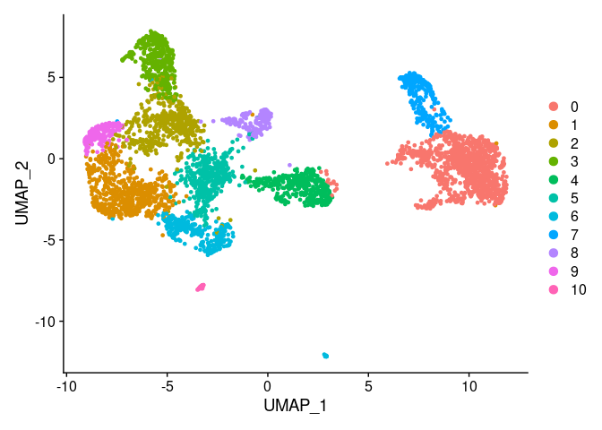<!-- -->

* Visualize the expression of genes of interest within the UMAP space:  


```r
gene_list <- c("C1qb", "Xcr1", "Il4i1", "Clec9a", "Fscn1", "Ltb", "Zbtb46", "Mki67", "Flt3", "Ly6d", "Cebpb", "Cd274", "Ccr7"  )
for (i in 1:length(gene_list)) 
{ 
#tiff(paste0(gene_list[i],"_4297_cells.tiff",sep=""), units="in", width=20, height=11, res=300)
tryCatch({ print(FeaturePlot(object = GSE131957_data, features = gene_list[i], reduction = "umap", pt.size = 1, cols = c("lightgrey", "red1"))) }, error=function(e){cat("ERROR :",conditionMessage(e), "\n")}) 
#dev.off()
}
```

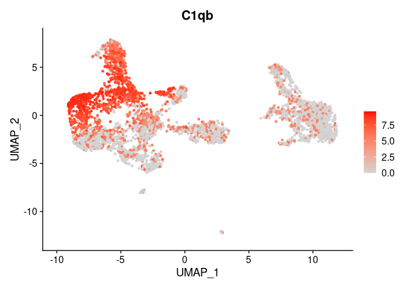<!-- -->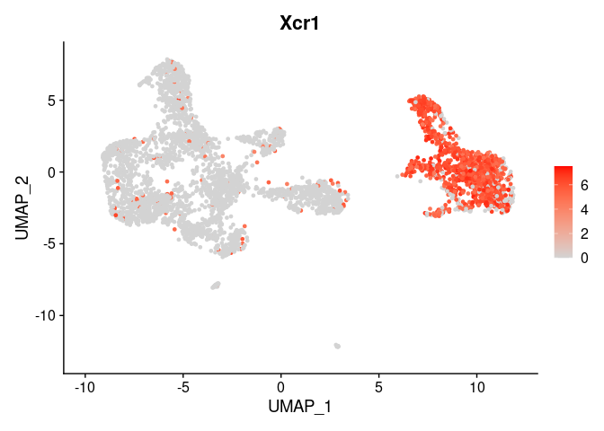<!-- -->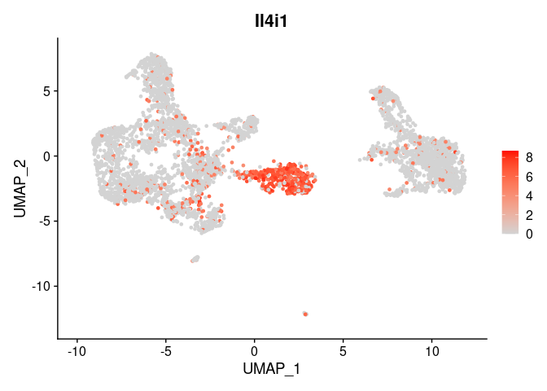<!-- -->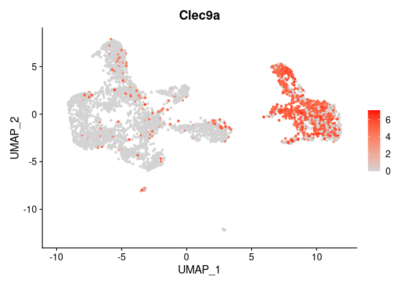<!-- --><!-- -->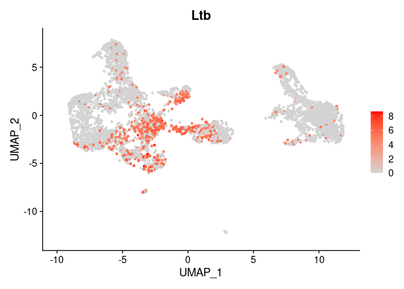<!-- -->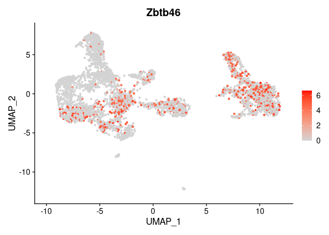<!-- -->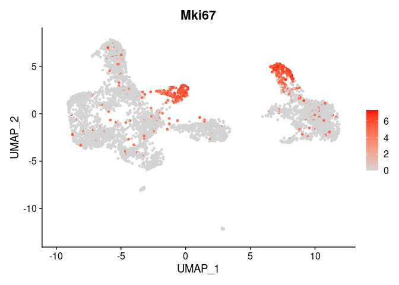<!-- -->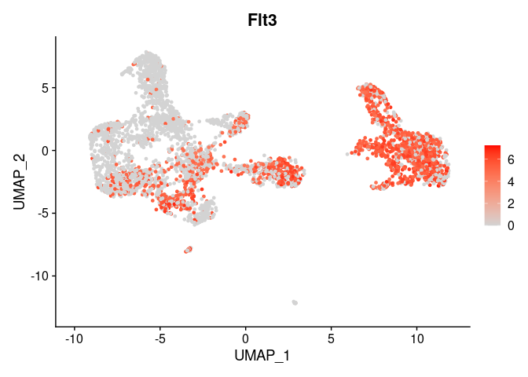<!-- -->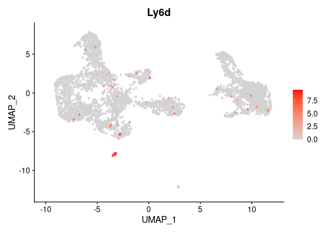<!-- -->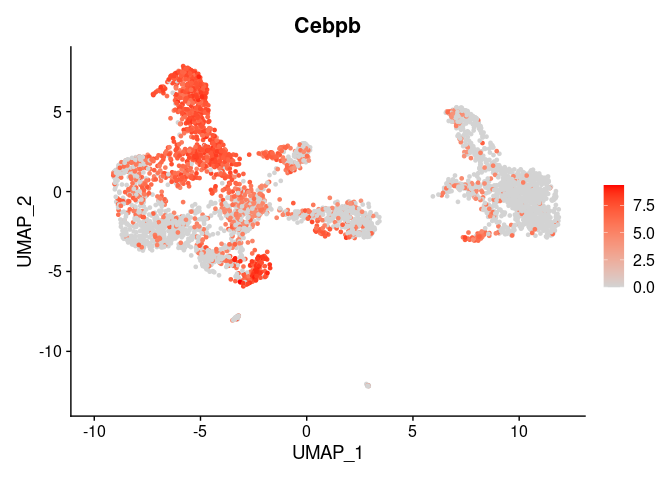<!-- -->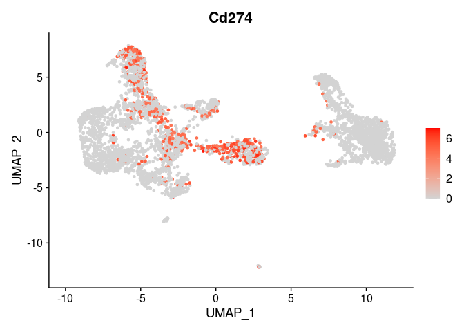<!-- -->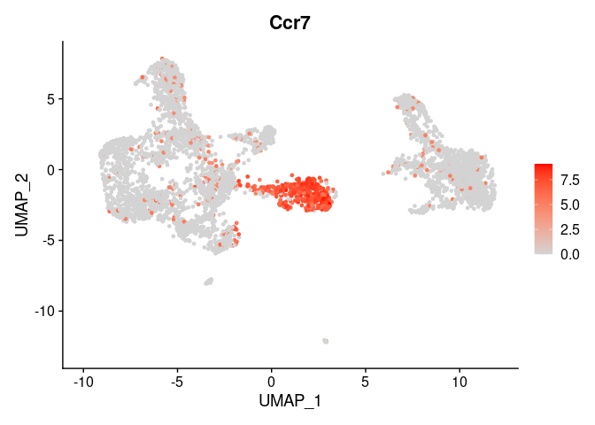<!-- -->

* Perform t-distributed stochastic neighbor embedding (tSNE) on the data


```r
GSE131957_data <- RunTSNE(object = GSE131957_data, reduction="pca", tsne.method="Rtsne", features = "var.features", dims= 1:9, seed.use=11)
```

* Visualize the cells and their cluster assignment within the tSNE space:


```r
DimPlot(GSE131957_data, reduction = "tsne", pt.size=1)
```

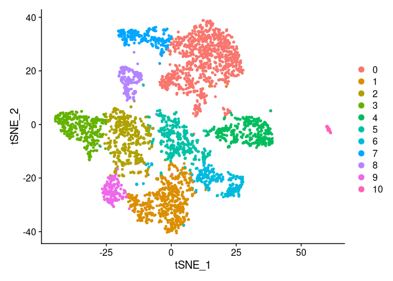<!-- -->

* Identify gene markers for each cluster:


```r
for(i in 0:(max(as.numeric(levels(GSE131957_data@meta.data$seurat_clusters))))) 
{ 
assign(paste("cluster", i,"_markers", sep = ""), FindMarkers(GSE131957_data, ident.1 = i, logfc.threshold = 1, test.use = "bimod", only.pos = TRUE)
)
print(paste("cluster", i,"_markers", sep = ""))
print(head(get(paste("cluster", i,"_markers", sep = "")),n=20)) }
```

```
## [1] "cluster0_markers"
##                  p_val avg_log2FC pct.1 pct.2     p_val_adj
## Cst3      0.000000e+00   1.588923 1.000 0.999  0.000000e+00
## Ppt1      0.000000e+00   2.761571 0.973 0.551  0.000000e+00
## Naaa      0.000000e+00   2.211400 0.986 0.664  0.000000e+00
## Plbd1     0.000000e+00   1.478741 0.990 0.793  0.000000e+00
## Cd24a     0.000000e+00   2.014681 0.968 0.462  0.000000e+00
## Irf8      0.000000e+00   2.510060 0.990 0.613  0.000000e+00
## Xcr1      0.000000e+00   3.333208 0.856 0.103  0.000000e+00
## Ckb       0.000000e+00   1.625283 0.980 0.674  0.000000e+00
## Rab7b    3.458460e-323   2.536375 0.839 0.227 4.798958e-319
## Id2      2.466057e-312   1.414173 0.984 0.706 3.421901e-308
## Sept3    1.835047e-305   3.227122 0.677 0.101 2.546311e-301
## Tlr3     2.734638e-302   3.329741 0.662 0.095 3.794583e-298
## Cadm1    3.938257e-301   2.406635 0.802 0.193 5.464725e-297
## Cxx1a    4.929881e-294   2.842555 0.738 0.189 6.840703e-290
## Itgae    1.352992e-273   2.703234 0.720 0.152 1.877412e-269
## Wdfy4    3.431208e-264   1.933989 0.865 0.364 4.761144e-260
## BC028528 1.010225e-257   1.703411 0.908 0.531 1.401788e-253
## Mpeg1    1.397414e-257   1.374137 0.959 0.630 1.939051e-253
## Txndc15  1.194021e-252   1.871348 0.833 0.412 1.656824e-248
## Clec9a   5.035478e-252   2.854548 0.640 0.112 6.987229e-248
## [1] "cluster1_markers"
##                  p_val avg_log2FC pct.1 pct.2     p_val_adj
## Mgl2     3.575954e-298   2.323885 0.947 0.433 4.961993e-294
## Cd209a   2.260812e-238   2.651783 0.811 0.243 3.137102e-234
## Clec4b1  5.212698e-233   2.693852 0.807 0.234 7.233140e-229
## S100a6   1.030886e-197   1.008600 0.994 0.868 1.430458e-193
## Tmem176b 4.428418e-193   1.353818 0.952 0.508 6.144873e-189
## Tmem176a 5.035925e-191   1.471289 0.934 0.469 6.987850e-187
## Tnip3    3.072958e-170   2.510124 0.769 0.324 4.264036e-166
## Pid1     1.028420e-138   1.592043 0.849 0.540 1.427036e-134
## Ear2     2.109135e-131   2.242444 0.724 0.293 2.926636e-127
## Mt1      3.904105e-124   1.790312 0.872 0.647 5.417336e-120
## Wfdc17   6.509552e-120   1.327158 0.928 0.600 9.032654e-116
## S100a4   9.670503e-115   1.032460 0.913 0.530 1.341879e-110
## Zfp36     3.769107e-91   1.230072 0.846 0.678  5.230013e-87
## Fcrls     6.288130e-91   3.371695 0.318 0.041  8.725409e-87
## Trf       2.330097e-90   1.221954 0.836 0.633  3.233243e-86
## Slamf9    8.930968e-88   1.419289 0.709 0.400  1.239261e-83
## Il1rl1    1.348988e-85   3.644817 0.257 0.025  1.871856e-81
## Lmo1      3.818440e-85   1.926975 0.525 0.212  5.298468e-81
## Skint3    1.244138e-84   2.443071 0.392 0.090  1.726365e-80
## Clec4a2   6.838718e-77   1.417588 0.652 0.308  9.489405e-73
## [1] "cluster2_markers"
##                 p_val avg_log2FC pct.1 pct.2     p_val_adj
## C1qb    4.232125e-199   2.234276 0.917 0.390 5.872496e-195
## Ctsc    1.235133e-192   1.797268 0.979 0.791 1.713870e-188
## Fcer1g  1.736465e-188   1.004100 1.000 0.933 2.409519e-184
## Cebpb   1.841096e-181   1.926133 0.947 0.343 2.554704e-177
## C1qa    4.893858e-179   2.213318 0.867 0.353 6.790717e-175
## C1qc    2.284035e-178   2.100283 0.843 0.274 3.169326e-174
## Prdx5   8.242402e-164   1.732209 0.968 0.756 1.143716e-159
## Fcgr3   5.369385e-155   1.858787 0.934 0.418 7.450558e-151
## Tgfbi   2.227204e-153   1.858134 0.964 0.648 3.090468e-149
## Clec4n  1.136565e-150   2.138090 0.881 0.330 1.577097e-146
## Csf1r   6.748757e-145   1.568536 0.922 0.396 9.364575e-141
## Pilra   7.238924e-129   2.063313 0.782 0.231 1.004473e-124
## Mafb    1.081230e-124   2.103916 0.674 0.147 1.500315e-120
## Lyz2    1.836128e-121   1.015516 0.998 0.977 2.547811e-117
## Fcgr1   1.216997e-117   2.467329 0.623 0.133 1.688705e-113
## Fcgr2b  3.061089e-117   1.574163 0.911 0.573 4.247566e-113
## Sirpb1c 5.649705e-110   2.176352 0.621 0.135 7.839530e-106
## Il1rn   1.134288e-101   2.798774 0.523 0.094  1.573938e-97
## Cd14    2.587112e-100   1.951802 0.792 0.310  3.589877e-96
## Lilrb4a  3.906752e-96   1.401678 0.828 0.337  5.421010e-92
## [1] "cluster3_markers"
##                p_val avg_log2FC pct.1 pct.2     p_val_adj
## Creg1   0.000000e+00   2.872685 0.965 0.556  0.000000e+00
## Fabp5   0.000000e+00   3.830687 0.970 0.385  0.000000e+00
## Ctss    0.000000e+00   2.567707 1.000 0.984  0.000000e+00
## Gpnmb   0.000000e+00   7.234350 0.874 0.101  0.000000e+00
## Cd9     0.000000e+00   2.383622 0.997 0.894  0.000000e+00
## Pld3    0.000000e+00   4.957536 0.932 0.130  0.000000e+00
## Ftl1    0.000000e+00   2.382206 1.000 1.000  0.000000e+00
## Ctsd    0.000000e+00   5.629206 1.000 0.450  0.000000e+00
## Cstb    0.000000e+00   3.059453 0.992 0.715  0.000000e+00
## Cd63    0.000000e+00   3.895875 0.975 0.324  0.000000e+00
## Lgals3  0.000000e+00   2.554096 0.997 0.955  0.000000e+00
## Ctsb    0.000000e+00   3.413559 0.995 0.839  0.000000e+00
## Fth1    0.000000e+00   2.731034 1.000 0.999  0.000000e+00
## Lyz2   8.857392e-318   2.868555 1.000 0.977 1.229052e-313
## Cd68   1.022839e-317   2.310537 0.982 0.779 1.419291e-313
## Cyba   2.139434e-303   1.662442 1.000 0.993 2.968678e-299
## Plin2  4.757925e-287   2.455312 0.965 0.650 6.602097e-283
## Sgk1   2.167484e-284   3.614969 0.917 0.213 3.007601e-280
## Syngr1 3.093735e-283   6.710455 0.679 0.020 4.292867e-279
## Spp1   1.647345e-279   4.718966 0.838 0.358 2.285856e-275
## [1] "cluster4_markers"
##                   p_val avg_log2FC pct.1 pct.2     p_val_adj
## Fscn1      0.000000e+00   7.551285 0.856 0.077  0.000000e+00
## Relb       0.000000e+00   3.991715 0.952 0.258  0.000000e+00
## Il4i1      0.000000e+00   5.335010 0.868 0.084  0.000000e+00
## Tmem123    0.000000e+00   4.417795 0.977 0.442  0.000000e+00
## Ccl5       0.000000e+00   6.059825 0.843 0.284  0.000000e+00
## Ccr7       0.000000e+00   6.965240 0.942 0.060  0.000000e+00
## Fam177a    0.000000e+00   3.622634 0.896 0.308  0.000000e+00
## Cacnb3     0.000000e+00   6.578445 0.772 0.022  0.000000e+00
## Rogdi      0.000000e+00   3.018043 0.959 0.448  0.000000e+00
## Samsn1     0.000000e+00   3.962551 0.937 0.218  0.000000e+00
## Marcksl1  5.047401e-313   3.368856 0.939 0.434 7.003773e-309
## Socs2     7.566296e-307   4.520307 0.853 0.120 1.049899e-302
## Traf1     4.367908e-305   3.020612 0.965 0.410 6.060909e-301
## Psme2     2.258154e-294   2.251611 0.985 0.805 3.133415e-290
## Iscu      8.231098e-292   2.413384 0.954 0.652 1.142147e-287
## Nudt17    3.605368e-280   6.835286 0.658 0.014 5.002808e-276
## Birc2     4.586538e-266   3.679162 0.828 0.187 6.364280e-262
## Serpinb6b 2.385413e-265   5.097929 0.785 0.096 3.309999e-261
## Ccl22     2.548248e-265   4.670794 0.853 0.149 3.535949e-261
## Epsti1    8.240790e-262   3.480690 0.706 0.398 1.143492e-257
## [1] "cluster5_markers"
##                  p_val avg_log2FC pct.1 pct.2     p_val_adj
## Mdh2     3.164452e-209   2.006920 0.985 0.772 4.390994e-205
## Ifitm1   2.562151e-162   3.836592 0.739 0.169 3.555241e-158
## Cfp      5.830649e-162   1.990198 0.967 0.517 8.090609e-158
## H2-DMb2  1.280571e-159   1.990465 0.972 0.569 1.776920e-155
## S100a6   1.088999e-130   1.200829 0.997 0.875 1.511095e-126
## Napsa    2.473315e-123   1.294240 0.997 0.839 3.431972e-119
## Cdh1     1.593802e-115   3.389895 0.511 0.059 2.211560e-111
## Ifitm3   5.365908e-109   1.402536 0.985 0.681 7.445734e-105
## Ffar2    7.630798e-107   3.417948 0.466 0.047 1.058850e-102
## Ifitm2    2.136855e-93   1.434273 0.977 0.647  2.965100e-89
## Il1r2     9.377019e-89   2.657230 0.554 0.112  1.301155e-84
## Ltb       8.020904e-87   2.458136 0.592 0.138  1.112981e-82
## S100a4    1.857807e-84   1.245164 0.947 0.549  2.577894e-80
## Plet1     5.386290e-84   2.421912 0.572 0.152  7.474015e-80
## Limd2     4.480341e-78   1.407835 0.878 0.462  6.216921e-74
## Fh1       2.133218e-76   1.627628 0.785 0.367  2.960053e-72
## Ccr1      3.546483e-76   1.519908 0.762 0.284  4.921100e-72
## Kmo       3.196394e-73   1.787050 0.694 0.257  4.435316e-69
## Klrd1     8.935246e-73   1.569278 0.861 0.441  1.239855e-68
## AA467197  6.814393e-70   1.476070 0.884 0.502  9.455651e-66
## [1] "cluster6_markers"
##                p_val avg_log2FC pct.1 pct.2     p_val_adj
## Ifitm3 9.141074e-182   2.421388 0.968 0.689 1.268415e-177
## Ifitm6 5.323155e-156   3.780176 0.689 0.140 7.386409e-152
## Lst1   2.859444e-118   2.713570 0.715 0.400 3.967764e-114
## Ifitm2 2.155654e-114   1.839330 0.949 0.656 2.991185e-110
## Plac8  5.802210e-110   2.712392 0.772 0.274 8.051147e-106
## Pou2f2 2.908460e-103   2.749713 0.667 0.272  4.035779e-99
## Il17ra  5.241842e-90   2.648896 0.474 0.201  7.273580e-86
## Itgal   1.581521e-83   2.699309 0.369 0.188  2.194518e-79
## Cd300a  8.697752e-82   1.879235 0.740 0.424  1.206900e-77
## Klf2    1.003798e-81   2.207916 0.766 0.432  1.392870e-77
## Gngt2   1.872457e-81   2.019233 0.769 0.604  2.598221e-77
## Adgre4  2.150730e-80   3.808278 0.394 0.059  2.984352e-76
## Ms4a6c  9.790801e-80   1.687861 0.817 0.593  1.358572e-75
## Spn     1.966259e-79   3.168697 0.410 0.111  2.728381e-75
## Fcer1g  4.582489e-79   1.170983 0.968 0.938  6.358662e-75
## Nr4a1   9.849007e-79   2.087176 0.715 0.389  1.366648e-74
## Ace     1.740035e-78   5.019971 0.298 0.022  2.414473e-74
## Gsr     7.367555e-78   2.282437 0.455 0.317  1.022322e-73
## Limd2   4.584975e-74   1.640375 0.679 0.486  6.362112e-70
## Rap1b   1.511919e-73   1.240152 0.830 0.800  2.097939e-69
## [1] "cluster7_markers"
##                       p_val avg_log2FC pct.1 pct.2     p_val_adj
## Hmgb2         3.122084e-236   2.992670 0.996 0.592 4.332204e-232
## Stmn1         2.729784e-188   3.476036 0.969 0.237 3.787848e-184
## Ptma          4.359781e-186   1.604516 1.000 0.994 6.049633e-182
## Cks1b         7.902491e-172   3.086021 0.926 0.250 1.096550e-167
## 2810417H13Rik 6.562860e-149   3.642781 0.801 0.096 9.106625e-145
## Tubb5         9.443444e-145   2.221716 0.988 0.829 1.310372e-140
## Irf8          1.924105e-132   1.252562 0.992 0.687 2.669889e-128
## Rrm2          5.291611e-131   4.361550 0.641 0.051 7.342640e-127
## Asf1b         1.258863e-130   3.574989 0.723 0.079 1.746798e-126
## Top2a         5.252899e-128   3.661180 0.711 0.081 7.288923e-124
## Cdk1          1.158082e-122   3.611854 0.691 0.077 1.606955e-118
## Mki67         1.785446e-122   3.526716 0.711 0.085 2.477484e-118
## Tuba1b        6.117422e-121   2.081132 0.953 0.698 8.488535e-117
## H2afz         9.921328e-121   1.284853 1.000 0.976 1.376683e-116
## Tmpo          5.068019e-118   2.196227 0.934 0.371 7.032384e-114
## Spc24         7.319415e-118   3.634540 0.664 0.068 1.015642e-113
## Kif23         8.121441e-114   3.737628 0.625 0.063 1.126931e-109
## Naaa          5.056879e-113   1.422069 0.996 0.727 7.016925e-109
## Cdca8         5.150456e-113   3.263513 0.703 0.095 7.146772e-109
## H2afx         1.970086e-111   2.815063 0.762 0.262 2.733692e-107
## [1] "cluster8_markers"
##                       p_val avg_log2FC pct.1 pct.2     p_val_adj
## Hmgb2         2.077860e-202   2.858104 1.000 0.598 2.883239e-198
## Stmn1         7.427593e-198   3.634927 0.989 0.249 1.030653e-193
## 2810417H13Rik 3.374445e-178   4.123084 0.973 0.100 4.682380e-174
## Birc5         3.257417e-169   4.139523 0.924 0.089 4.519992e-165
## Tuba1b        6.768733e-159   2.476078 0.984 0.701 9.392294e-155
## Top2a         9.620702e-149   4.033148 0.892 0.084 1.334969e-144
## Tubb5         2.601761e-137   2.227349 1.000 0.831 3.610203e-133
## Mki67         7.789136e-137   3.636568 0.881 0.089 1.080821e-132
## H2afz         3.427801e-135   1.584954 1.000 0.976 4.756416e-131
## Ccna2         1.883303e-132   4.131558 0.773 0.045 2.613271e-128
## Cks1b         2.331239e-132   2.837937 0.978 0.259 3.234827e-128
## Cdca3         9.938745e-132   4.013984 0.811 0.063 1.379100e-127
## Spc24         2.773209e-130   3.738189 0.832 0.070 3.848105e-126
## Cdca8         1.638688e-128   3.570395 0.870 0.098 2.273843e-124
## Nusap1        8.230357e-122   3.886723 0.724 0.041 1.142044e-117
## Hmgb1         7.518492e-121   1.873696 1.000 0.707 1.043266e-116
## Smc2          2.509140e-120   3.397332 0.865 0.135 3.481682e-116
## Ptma          7.994156e-120   1.404630 1.000 0.994 1.109269e-115
## Ube2c         3.319376e-118   3.997148 0.757 0.058 4.605966e-114
## Ube2s         9.736690e-117   2.170648 0.968 0.477 1.351063e-112
## [1] "cluster9_markers"
##                  p_val avg_log2FC pct.1 pct.2     p_val_adj
## C1qa     3.564817e-234   3.696989 1.000 0.385 4.946540e-230
## C1qb     1.506862e-226   3.340933 1.000 0.424 2.090922e-222
## C1qc     7.235335e-219   3.672494 1.000 0.309 1.003975e-214
## Sepp1    7.882703e-206   3.920719 0.965 0.356 1.093804e-201
## Serinc3  5.953868e-159   2.618222 0.965 0.658 8.261587e-155
## Adgre1   7.071212e-153   3.952087 0.850 0.174 9.812014e-149
## Cd81     7.280649e-153   2.712064 0.994 0.582 1.010263e-148
## Csf1r    1.363909e-135   2.794284 0.931 0.434 1.892560e-131
## Ms4a7    2.606494e-124   4.486565 0.757 0.103 3.616772e-120
## C3ar1    1.619061e-123   3.847205 0.786 0.142 2.246609e-119
## Hexb     1.564076e-119   2.161091 0.960 0.749 2.170312e-115
## Ctsc     6.809428e-104   1.979771 0.988 0.805 9.448763e-100
## Cx3cr1   1.398619e-103   3.569460 0.763 0.153  1.940724e-99
## Lgmn     2.108604e-102   2.196155 0.977 0.516  2.925900e-98
## Lilra5   2.683439e-102   4.703372 0.607 0.050  3.723540e-98
## Cd72      7.470653e-97   3.112015 0.757 0.275  1.036628e-92
## Tmem176b  1.847874e-96   1.954790 1.000 0.554  2.564110e-92
## Itm2b     3.855709e-96   1.381308 1.000 0.987  5.350182e-92
## Mafb      1.223431e-89   3.338749 0.780 0.181  1.697634e-85
## Cd14      5.629172e-89   2.528914 0.925 0.339  7.811039e-85
## [1] "cluster10_markers"
##                     p_val avg_log2FC pct.1 pct.2     p_val_adj
## Bst2        3.112920e-138   4.311914 1.000 0.600 4.319488e-134
## Siglech     9.339001e-132   8.289747 1.000 0.033 1.295880e-127
## Ccr9        1.042773e-113   7.986323 1.000 0.031 1.446952e-109
## Ly6d         1.638217e-96   9.548521 0.974 0.016  2.273190e-92
## Tcf4         8.144693e-91   4.254838 1.000 0.291  1.130158e-86
## Dnajc7       8.571015e-90   3.578950 1.000 0.528  1.189314e-85
## Cox6a2       1.934841e-85   8.558467 0.947 0.016  2.684785e-81
## Atp1b1       1.930960e-82   8.621156 1.000 0.006  2.679401e-78
## Cd8b1        1.149607e-76  10.076118 0.868 0.004  1.595195e-72
## Tsc22d1      2.447572e-70   5.131500 0.947 0.109  3.396252e-66
## Pacsin1      5.176835e-67   6.328014 0.895 0.037  7.183376e-63
## Sell         6.998777e-67   6.354912 0.974 0.037  9.711503e-63
## D13Ertd608e  1.399097e-66   8.280059 0.789 0.001  1.941387e-62
## Smim5        5.397051e-66   5.156699 0.921 0.102  7.488948e-62
## Lag3         4.241337e-65   5.625637 0.974 0.065  5.885279e-61
## Lair1        4.156015e-63   4.065020 1.000 0.231  5.766886e-59
## Klk1         7.525453e-61   9.606646 0.737 0.001  1.044232e-56
## Ly6c2        4.661624e-60   5.924294 0.947 0.050  6.468469e-56
## Prkca        1.088919e-57   5.877327 0.816 0.040  1.510984e-53
## Lefty1       1.535154e-57   6.631338 0.842 0.015  2.130180e-53
```

  Where 
   + only.pos = TRUE will give only positive markers/genes for each cluster, 
   + logfc.threshold = 1 will return genes that have a fold change higher than 1 in a log2 scale, between the cluster of interest and the other clusters (See Note 16). 

* Make violin plots to show the expression of particular genes across all clusters (we use the same gene list as previously defined):


```r
for (i in 1:length(gene_list)) { tryCatch({
      print(VlnPlot(object = GSE131957_data, features = gene_list[i], pt.size = 1)) }, error=function(e){cat("ERROR :",conditionMessage(e), "\n")}) }
```

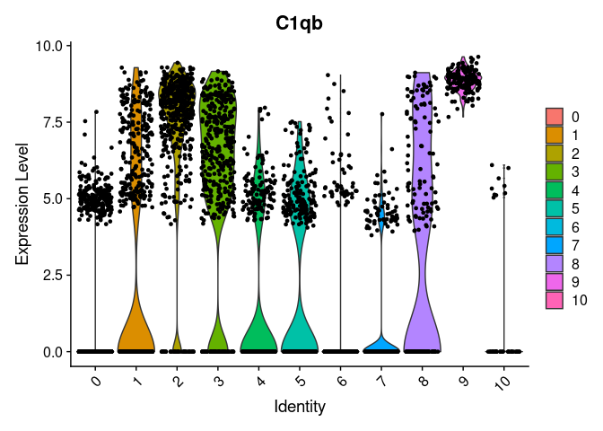<!-- -->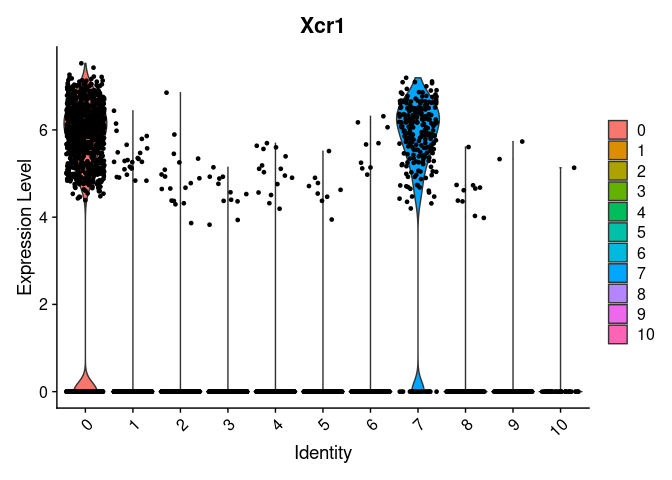<!-- -->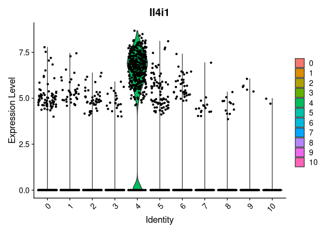<!-- -->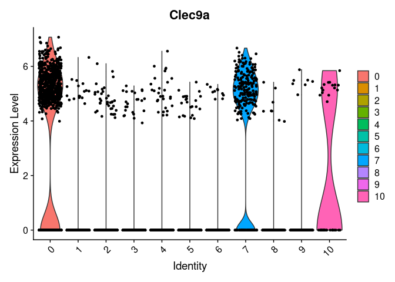<!-- -->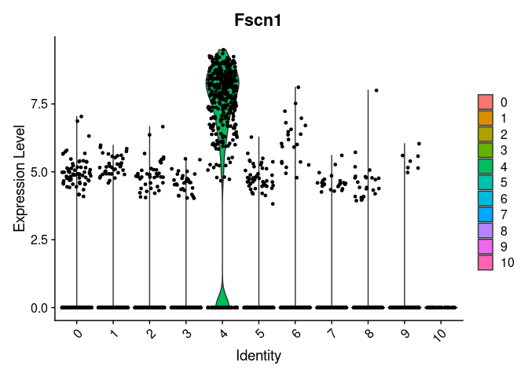<!-- -->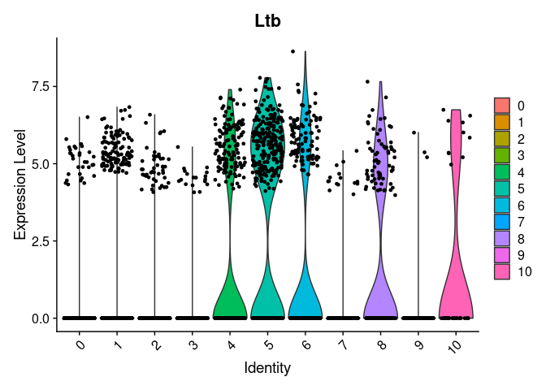<!-- -->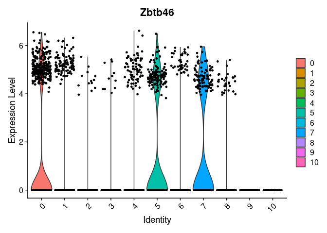<!-- -->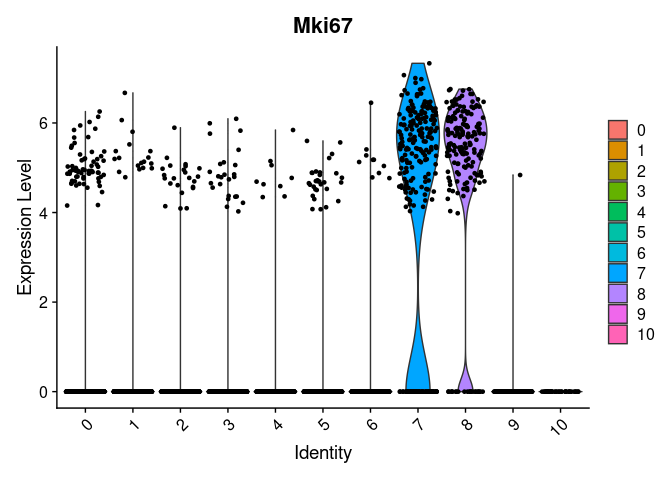<!-- -->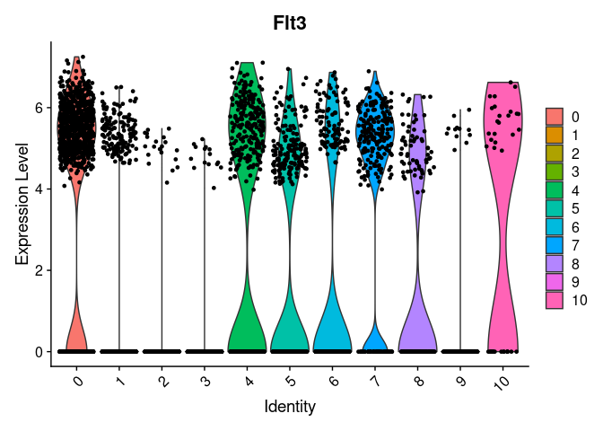<!-- -->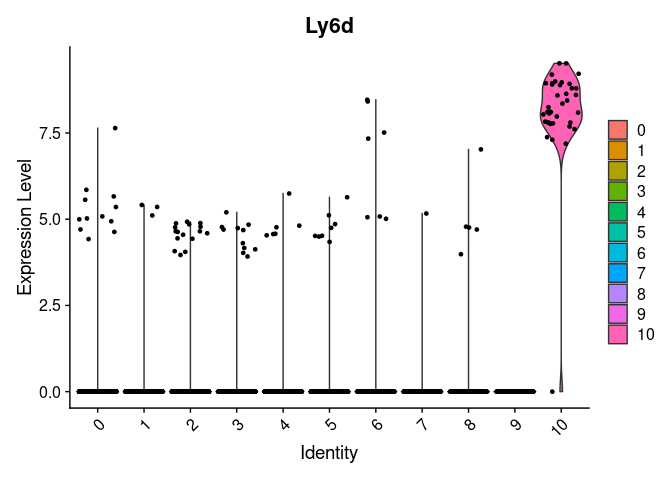<!-- -->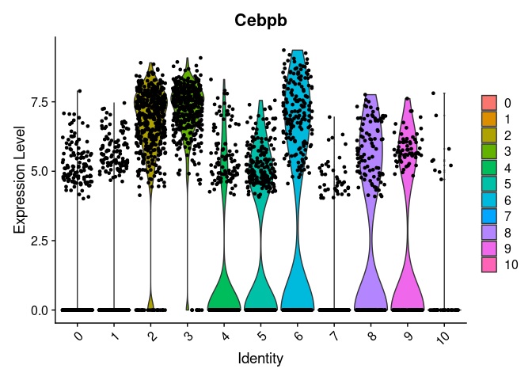<!-- -->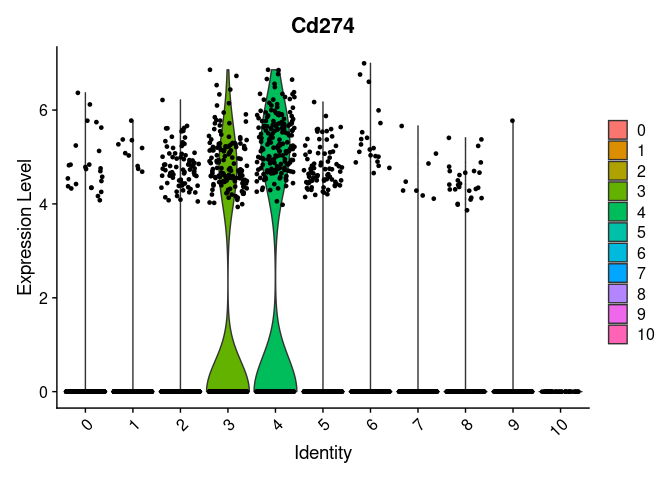<!-- -->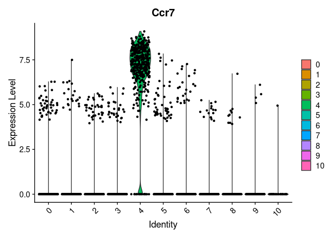<!-- -->

### Identification and removal of Contaminants

Cluster annotation is a critical task and should be carried out with a lot of caution. Using various methods to confirm cluster identity may be helpful (See Note 4) . 


### Annotate clusters using cluster markers (by scrutinizing the marker genes generated earlier):

* For cluster 0, marker genes encompass genes known to be specifically expressed in cDC1s, including the genes negatively associated to PC1 (e.g. Xcr1, Sept3, Cd24a, Tlr3, Cadm1, Id2) as well as Ppt1, Naaa, Irf8, Hepacam2 and Wdfy4. Hence, cluster 0 is enriched in cDC1s. However, it is possible that not all cells from cluster 0 are cDC1; this cluster could be heterogeneous and encompass other cell types.

* Markers of cluster 2 encompass genes known to be specifically expressed in monocytes/macrophages, including genes positively associated to PC1 (e.g. Cebpb, Clec4n, Lilrb4a, C1qb, C1qc) as well as C1qa, Csf1r, Mafb, Fcgr1, Sirpb1c, Cd14 (as shown in table 1). Hence, cluster 2 is enriched in monocytes/macrophages. This confirms that one of the major source of variability in the dataset is the presence of different types of mononuclear phagocytes including cDC1s and monocytes/macrophages.

* Cluster 4 markers encompass genes known to be specifically expressed in mature DCs, including genes negatively associated to PC2 (e.g. Cacnb3, Ccr7, Nudt17, Fscn1, Il4i1, Serpinb6b) as well as Marcksl1, Relb, Ccl5, Rogdi, Psme2, Traf1, Socs2 (as shown in table 1). Hence, we can conclude that cluster 4 is enriched in mature DCs, but without knowing of which type, i.e. mature cDC1s and/or cDC2s or MoDCs.

* Cluster 7 markers encompass genes expressed in proliferative cells, including genes positively associated to PC2 (e.g. Top2a, Mki67, Cdca8) as well as Cdk1, Tuba1b, Kif23 (as shown in table 1). Hence, cluster 7 is enriched in proliferating cells, but without knowing of which type, i.e. cDC1s and/or cDC2s and/or macrophages. Another major source of variability in the dataset is the presence of cells in different activation states; including immature and proliferative cells versus mature DCs.

### Annotate clusters using Immgen:

Cluster classification cannot be finalized based only on cluster markers. Here, we will use an external reference database for the mouse model, Immgen.
Immgen is a database that contains expression information about immune cells. It includes many tools and datasets. One of them, MyGeneset, allows predicting the cell types based on the gene markers.


a. Go to https://www.immgen.org/ and click on Databrowsers.
b. Click on MyGeneset.
c. Under the tab "Select the populations of interest" click on Check All.
d. Enter the top 50 markers for the clusters in box "Input a list of Gene Symbols: " 
e. Click on view W-plot. It will give a slope with cells mentioned up and down (as shown in fig),  
f. If the slope is higher for particular cells then there are chances that in a particular cluster there are cells which belong to that group of cells (fig 4).
g. This shows that C0 and C6 are enriched in cDC1 (as shown in fig). C4 corresponds to mature DCs, maybe both cDC1 and cDC2 (as shown in fig ). C7 and C8 correspond to proliferating cells and might encompass cDC1 (as shown in fig). 

For certain cell states, the transcriptomic signature linked to the biological state of the cells is prominent over the cell type identity, like for mature cDC or proliferating cells. Hence more precise analyses are needed to identify cDC1 with enough accuracy, and at the single cell and not cluster level, since some clusters are heterogeneous in terms of cell type composition and this heterogeneity cannot be solved with classical clustering analyses.

### Cell annotation using cMap 

Cell type specific signatures were extracted from an independent public microarray database (Immgen link) using the GeneSign module of BubbleGUM (PMID: 26481321). 

The cMap algorithm allows evaluating the enrichment of specific gene signatures within samples of interest compared in a pairwise manner (PMID: 17008526). We modified the original algorithm to allow evaluating the enrichment of of signatures in single samples, such as single cells. The R code is available from our Github repository (https://github.com/DalodLab/MDlab_cDC1_differentiation). Here is the procedure to perform cMap at the single cell level: 

* Download the cMap .R files, by typing in a Terminal:


```r
wget https://github.com/DalodLab/MDlab_cDC1_differentiation/blob/main/data/files_for_cmap_analysis/sgCMAP_score.R
wget https://github.com/DalodLab/MDlab_cDC1_differentiation/blob/main/data/files_for_cmap_analysis/sgCMAP-internal.R
```

* Source the cMap .R files, by typing in the Rstudio session (same container):


```r
source("sgCMAP_score.R")
source("sgCMAP-internal.R")
```

* Read the signature files and create signature lists (See Note 17): 


```r
signatures_neg <- read.csv("negative_cDC1_relative_signatures.csv", sep=",", header=T, stringsAsFactors=FALSE)

signatures_pos <- read.csv("positive_cDC1_relative_signatures.csv", sep=",", header=T, stringsAsFactors=FALSE)

neg_list <- as.list(as.data.frame(signatures_neg))

pos_list <- as.list(as.data.frame(signatures_pos))
```

* Get the names of the positive and negative signatures, assign them to each signature using a for loop: 


```r
neg_sigs <- c(names(neg_list))

pos_sigs <- c(names(pos_list))

for (i in 1:length(neg_sigs))
{ sig_name <- neg_sigs[i]
  assign(sig_name , list(neg_list[[sig_name]]))
  sig_name <- pos_sigs[i]
  assign(sig_name , list(pos_list[[sig_name]])) 
}
```

* Generate the cMap scores for the transcriptomic signatures:


```r
for (i in 1:length(neg_sigs))
{ sig_name <- unlist(gsub("pos","score",pos_sigs[i]))
assign(paste("res_sgCMAP_",sig_name,"_sig",sep=""),sgCMAP_score(GSE131957_data@assays$RNA@data, get(pos_sigs[i]), get(neg_sigs[i]), perm=1000, ref=NULL, scaling="none"))
metadata[ , sig_name] = as.vector(get(paste0("res_sgCMAP_", sig_name, "_sig", sep=''))[["Score"]]) }


write.table(metadata, "metadata_wo_conta_removal_with_cmap_scores.txt", sep="\t", quote=F)
```
* This is temporary chunk and should be removed afterwords


```r
metadata <- read.table("metadata_wo_conta_removal_with_cmap_scores.txt")
```
* Here, a loop was used to calculate the cMap scores for each cell type specific signature on each single cell. The metadata object is updated with the calculated scores (See Note 18). This takes quite a long time to proceed. However, one can perform the enrichment of the transcriptomic signatures one by one by typing: 


```r
res_sgCMAP_cDC1_over_B_2x <- sgCMAP_score(GSE131957_data@assays$RNA@data, cDC1_over_B_2x_pos, cDC1_over_B_2x_neg, perm=500, ref=NULL, scaling="none")
```

* Visualize the cMap enrichment scores of the signatures: 


```r
for( i in 10:16)
{
p <- ggplot(metadata, aes(x=UMAP_1, y=UMAP_2)) + geom_point(aes(colour= metadata[,i]), size=2) + scale_colour_gradientn(colours=c("darkblue", "blue", "grey", "orange", "red")) + theme(panel.background = element_rect(fill = 'white', colour = 'black')) + labs(colour = names(metadata)[i]) 
#tiff(paste0(i,"_cmap_plot.tiff",sep = ""), units="in", width=20, height=11, res=300)
print(p)
#dev.off()
}
```

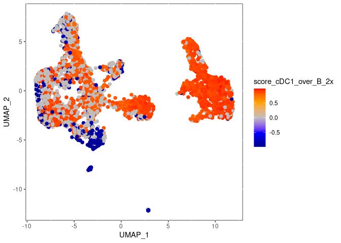<!-- -->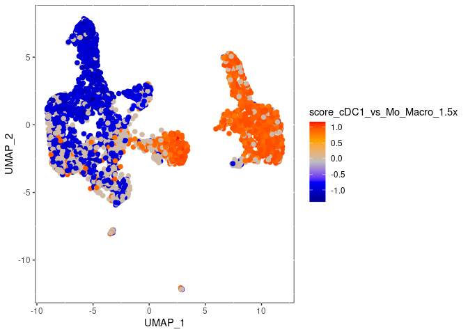<!-- -->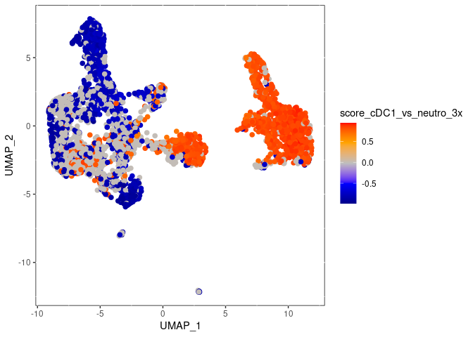<!-- -->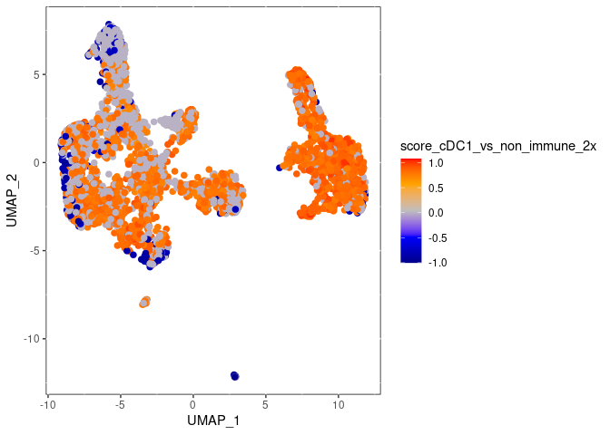<!-- -->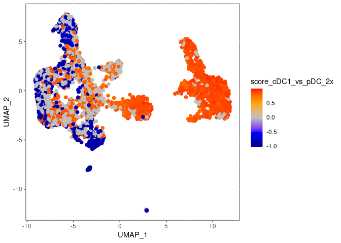<!-- -->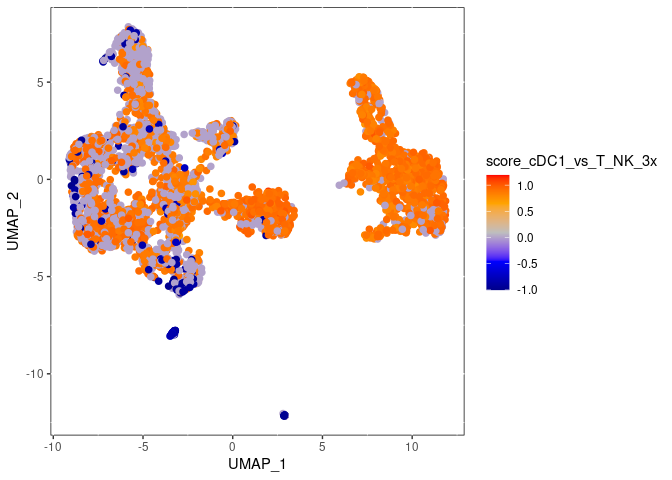<!-- -->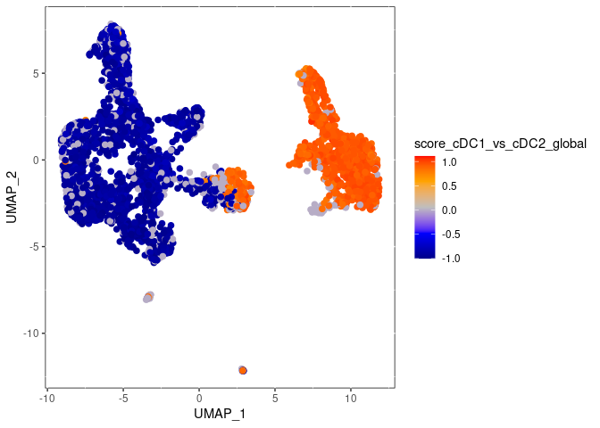<!-- -->

 Where 
  + scale_colour_gradientn is used to define colors for the gradient representing the high and low values of cMap scores for each cell shown on the UMAP space, scale_shape_manual is used for assigning shapes to the “type” (“naive” and “tumor bearing” lungs) information from the metadata object. 

For making plots for other signatures, just replace the name of the signature in geom_point(aes(colour= score_cDC1_over_B_2x)

This analysis confirms that clusters C0, C6 and C7 encompass a majority of cDC1, and that cluster C4 encompass a significant but lower proportion of cDC1 mixed with other cells including cDC2.

* We then select the cells having cMap scores which are strictly positive for all signatures as being cDC1 cells:


```r
cDC1_cells <- rownames(metadata[which( metadata$score_cDC1_over_B_2x > 0  & metadata$score_cDC1_vs_cDC2_global > 0 & metadata$score_cDC1_vs_Mo_Macro_1.5x > 0   &  metadata$score_cDC1_vs_neutro_3x > 0 & metadata$score_cDC1_vs_non_immune_2x > 0 & metadata$score_cDC1_vs_pDC_2x > 0   & metadata$score_cDC1_vs_T_NK_3x > 0   ),])
length(cDC1_cells)
```

```
## [1] 953
```

Here, because we want to later perform trajectory inference analyses, we decided to be very stringent on the cDC1 selection, in order to ensure a lack of contaminants that could bias the trajectory analyses. We are aware that some bona fide cDC1 may be missed using this stringent selection, but this is in favour of a more accurate trajectory inference analysis. According to our cMap-based strategy, we ended up
with 953 cDC1 cells.

* In order to visualize the cells identified as cDC1 versus the other cells, add a new column in the metadata object, labelling the cells as being cDC1 (TRUE) or not (FALSE) according to our strategy:

```r
metadata$select <-  rownames(metadata) %in% cDC1_cells
```

* Plot into the UMAP space the cells identified as cDC1 in red and the others in grey:

```r
#tiff("cells_selected.tiff", units="in", width=20, height=11, res=300)
ggplot(metadata, aes(UMAP_1, UMAP_2)) + geom_point(aes(color = select), data = metadata[metadata$select == FALSE, ]) + geom_point(aes(color = select), data = metadata[metadata$select == TRUE, ]) + labs(title = "Selected Cells") + scale_colour_manual(values = c("grey","red")) + theme_classic() + theme(plot.title = element_text(hjust = 0.5))
```

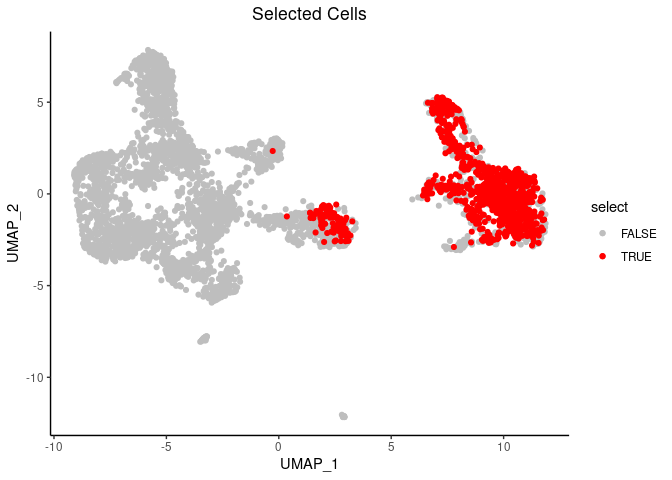<!-- -->

```r
#dev.off()
```

### Evaluation of our cell identity annotation strategy:

In the original article (Maier et al. REF), the authors have generated CITE-seq (Cellular Indexing of Transcriptomes and Epitopes by Sequencing) data, a method which allows to quantify gene transcription along with the expression of some surface proteins using available antibodies, at the single cell level. These ADT were relative to CD103, CD11b, CD11c, MHC-II and XCR1. We did not use these Antibody-Derived Tags (ADT) on purpose because most single cell datasets do not have such information. Nevertheless, these ADT give us the opportunity to evaluate, in an independent manner, the robustness of our single cell cMap annotation strategy based only on gene expression analysis.

* Make a dataframe using the log2-transformed ADT information present in the metadata object and plot the protein expressions for each cell within each
cluster (Figure 5):


```r
metadata[1:5] <-  round(log2(metadata[1:5] + 1),digits = 2)

for(i in 1:5)
{ 
p <- ggplot(metadata, aes(x=as.factor(clusters_res.0.3),y=metadata[,i] , color=select))  +  geom_boxplot(show.legend = FALSE,outlier.shape=NA) + geom_point(position=position_jitterdodge(0.15),size = 0.5,show.legend = FALSE) + scale_colour_manual(values = c("grey","red")) + xlab("Clusters") + ylab(paste0(names(metadata[i]), " Expression" , sep = "")) + theme_classic() 
#tiff(paste0(names(metadata[i]), "_boxplot.tiff" , sep = ""), units="in", width=20, height=11, res=300)
print(p)
#dev.off()
}
```

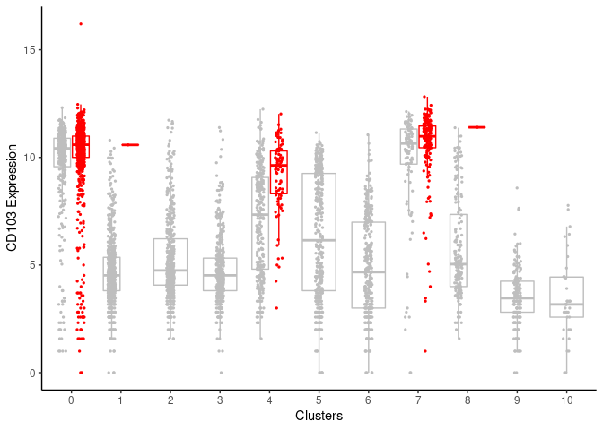<!-- -->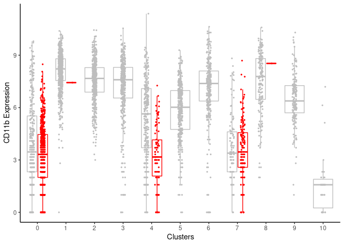<!-- -->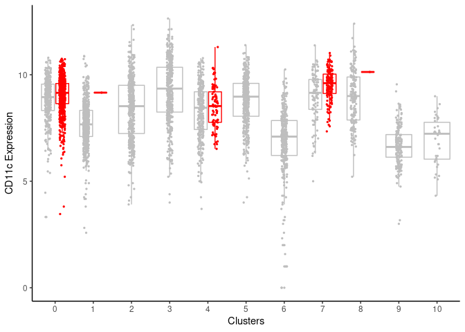<!-- -->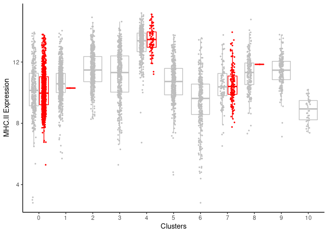<!-- -->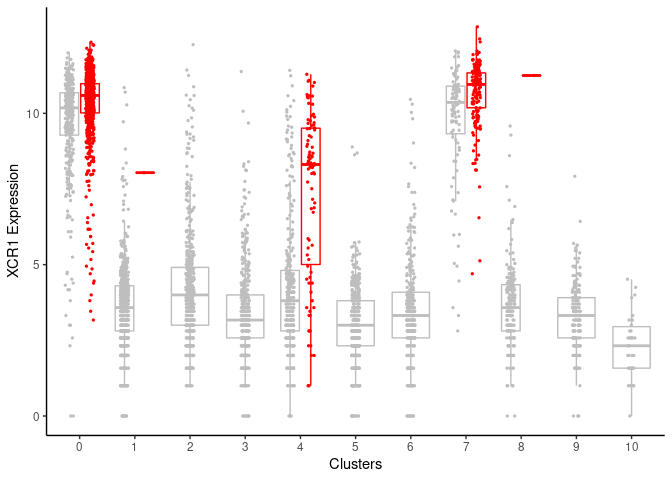<!-- -->

In Maier et al., the authors took advantage of the ADT information in order to identify the bona fide cDC1. We compared the 953 cDC1 identified by our strategy based solely on gene expression with the cell annotations the authors assigned, and found that among them, 857 were annotated DC1, 91 were annotated mregDC and 5 cells were annotated DC2.

### Running the Seurat workflow on the cDC1 cells

In this section, we re-perform the Seurat workflow on the 953 cells identified as cDC1, in order to apply downstream trajectory inference analyses.

* In the metadata dataframe relative to the whole dataset, remove the data unused for further analyses by keeping only the ADT information and the
tissue information:


```r
metadata <- metadata[,1:6]
```

* Subset the Seurat object and the metadata dataframe, to focus only on the cDC1 identified by cMap (See Note 19):


```r
GSE131957_data_flt <- GSE131957_data[,which(colnames(GSE131957_data) %in% cDC1_cells)]

metadata_flt <- metadata[rownames(metadata) %in% (cDC1_cells), , drop=F]
```


* Show the number of cells and genes in the new Seurat object


```r
dim(GSE131957_data_flt)
```

```
## [1] 13876   953
```

The dataset contains 13876 cells and 966 genes.

We proceed with this cDC1 filtered dataset the same way as we proceeded earlier for the whole dataset (Find variable genes, scaling and PCA):


```r
GSE131957_data_flt <- FindVariableFeatures(object=GSE131957_data_flt, nfeatures = 1000)
all.genes.cDC1 <- rownames(GSE131957_data_flt)
GSE131957_data_flt <-  ScaleData(GSE131957_data_flt, features = all.genes.cDC1)
```

```
## Centering and scaling data matrix
```

```r
GSE131957_data_flt <- RunPCA(GSE131957_data_flt, features = VariableFeatures(object = GSE131957_data_flt))
```

```
## PC_ 1 
## Positive:  Socs2, Ccr7, Cacnb3, Nudt17, Fscn1, Il4i1, Tnfrsf4, Anxa3, Ftl1, Gadd45b 
## 	   Mreg, Tnfrsf9, Arl5c, Gm13546, Cd63, Serpinb9, Stat4, Il21r, Tmcc3, Ccl22 
## 	   Samsn1, B2m, Snn, Ankrd33b, Il12b, Tmem150c, Zmynd15, Serpinb6b, Ramp3, Malat1 
## Negative:  Ptma, Asf1b, 2810417H13Rik, Nusap1, Spc24, Rrm2, Pbk, Top2a, Ccna2, Mki67 
## 	   Birc5, Tk1, Ndc80, Kif22, Stmn1, Tacc3, Ckap2l, Fbxo5, Smc2, Cdca3 
## 	   Cdk1, Prc1, Spc25, Aurkb, Casc5, Ncapg, Cenpf, Mxd3, Kif20b, Cdca8 
## PC_ 2 
## Positive:  Ccr7, Socs2, Cacnb3, Fscn1, Nudt17, Cd63, Anxa3, Serpinb9, Samsn1, Tnfrsf4 
## 	   Il4i1, Gadd45b, Cmc2, Gm13546, Serpinb6b, Relb, Stat4, Top2a, Mreg, Tnfrsf9 
## 	   Csrp1, Il21r, Arl5c, Spc24, Il12b, Tmcc3, Glipr2, Eno3, Nusap1, Snn 
## Negative:  H2-Ab1, Ppt1, Gm2a, Psap, Lyz2, Ly6e, Rgs2, Btg2, Klf2, Cxx1b 
## 	   Jund, Tmsb10, Ltb4r1, Gsn, Hspa1a, Qpct, Itgae, Ldha, Fos, Xlr 
## 	   Sult1a1, Cfh, Jun, S100a10, Pdia6, Hspa5, Phlda1, Fcrla, Adrb2, Klrd1 
## PC_ 3 
## Positive:  Plet1, Ung, Cdca7, Ctsa, Syce2, Serpina3g, Mcm2, Cxcl9, Ppa1, Mcm3 
## 	   Mcm6, Chaf1b, Hic1, Cdc6, Mcm5, Plgrkt, Mcm4, Ctsd, Lig1, Gins2 
## 	   Fcgr3, Ccne1, Procr, Dscc1, Mif, Mcm7, Siva1, Ranbp1, Cdt1, Ldha 
## Negative:  Cenpf, Ccnb1, Crip1, Ube2c, Ccnb2, Cdc20, Plk1, Lockd, Cdc25c, Cdkn3 
## 	   S100a10, Aspm, Cenpa, Kif2c, Nek2, Ckap2, Pif1, Kif20a, Ltb4r1, Klf2 
## 	   Cep55, Psrc1, Hmmr, Fam64a, Cdca3, Prc1, Kif11, Spag5, Ccdc18, Knstrn 
## PC_ 4 
## Positive:  Crip1, Ung, Lig1, Cdc6, Mcm6, Mcm2, Dscc1, Cdca7, Mcm3, Cdt1 
## 	   Chaf1b, Mcm7, Dtl, S100a10, Gins2, Mcm5, Ccne2, Pdlim1, Hells, Dhfr 
## 	   Prim1, Tipin, Ltb4r1, Wdhd1, Fignl1, Dnmt1, Rpa2, Gmnn, Calm1, E2f1 
## Negative:  Plet1, Ccnb1, Ctsa, Cenpf, Serpina3g, Cdc20, Hic1, Ccnb2, Gpr171, Ube2c 
## 	   Lpcat2, Plk1, Ifitm2, Procr, Cxcl9, Ctsd, Kif2c, Cenpa, Bvht, Cdkn3 
## 	   Spp1, Apoe, Clec10a, Troap, Flot1, Cdc25c, Ckap2, Ifitm3, Fndc5, 2310031A07Rik 
## PC_ 5 
## Positive:  Tmsb4x, B2m, Epsti1, Tmsb10, Lamp1, Calm1, Limd2, Fabp5, Phf11a, Tubb2a 
## 	   AW112010, Net1, Trpm2, Apoe, Gypc, Slc4a8, Ctsd, Cldnd1, Fndc5, Dek 
## 	   Ppdpf, 2700094K13Rik, Samhd1, Casp6, Parp14, Psme2, Ppia, Plac8, 9530059O14Rik, Plxnc1 
## Negative:  Zfp36, Egr1, Atf3, Nr4a1, Dusp2, Fos, Ier2, Tnip3, Tnfaip3, Nfkbia 
## 	   Trib1, Nfkbiz, Pim1, Junb, Fosb, Dusp1, Cdkn1a, Tnfsf9, Cd83, Tnf 
## 	   Nfkbid, Bhlhe40, Socs3, Csrnp1, Ppp1r15a, Jund, Jun, Btg1, Pmaip1, Lmna
```

```r
ElbowPlot(GSE131957_data_flt)
```

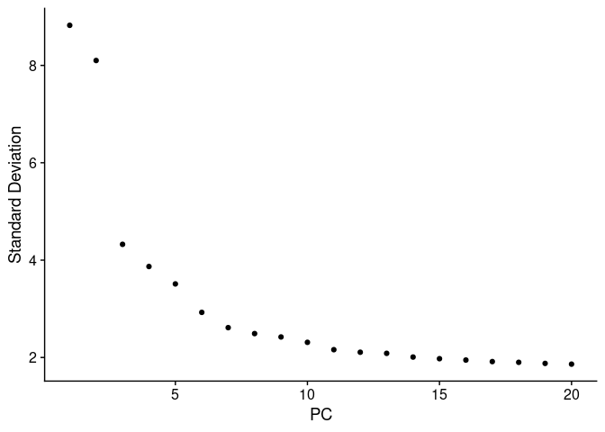<!-- -->

Based on the manual inspection of the elbow plot we choose the first six principle components for downstream analysis.

* We pursue with the clustering and UMAP analyses:


```r
GSE131957_data_flt <- FindNeighbors(GSE131957_data_flt, dims = 1:6, k.param=10)
```

```
## Computing nearest neighbor graph
```

```
## Computing SNN
```

```r
GSE131957_data_flt <- FindClusters(GSE131957_data_flt, resolution = 0.2,  random.seed=0)
```

```
## Modularity Optimizer version 1.3.0 by Ludo Waltman and Nees Jan van Eck
## 
## Number of nodes: 953
## Number of edges: 12290
## 
## Running Louvain algorithm...
## Maximum modularity in 10 random starts: 0.9201
## Number of communities: 7
## Elapsed time: 0 seconds
```

```r
GSE131957_data_flt <- RunUMAP(GSE131957_data_flt, dims = 1:6, seed.use=10, n.components=2, n.neighbors = 10, min.dist = 0.7)
```

```
## 08:19:30 UMAP embedding parameters a = 0.3208 b = 1.563
```

```
## 08:19:30 Read 953 rows and found 6 numeric columns
```

```
## 08:19:30 Using Annoy for neighbor search, n_neighbors = 10
```

```
## 08:19:30 Building Annoy index with metric = cosine, n_trees = 50
```

```
## 0%   10   20   30   40   50   60   70   80   90   100%
```

```
## [----|----|----|----|----|----|----|----|----|----|
```

```
## **************************************************|
## 08:19:30 Writing NN index file to temp file /tmp/RtmpSEyupg/file62e1423e05ca
## 08:19:30 Searching Annoy index using 1 thread, search_k = 1000
## 08:19:30 Annoy recall = 100%
## 08:19:31 Commencing smooth kNN distance calibration using 1 thread
## 08:19:33 Initializing from normalized Laplacian + noise
## 08:19:33 Commencing optimization for 500 epochs, with 11698 positive edges
## 08:19:34 Optimization finished
```

The clustering identified 7 communities, corresponding to 7 different activation states of cDC1.

* Add UMAP coordinates and clusters information into the metadata


```r
metadata_flt <- cbind(metadata_flt, as.data.frame(GSE131957_data_flt[["umap"]]@cell.embeddings), GSE131957_data_flt$RNA_snn_res.0.2)
write.table(metadata_flt,"metadata_flt_wo_conta.txt",sep="\t",quote = F)
```

* Add column names to metadata


```r
colnames(metadata_flt) <- c("CD103", "CD11b", "CD11c", "MHC-II", "XCR1", "type", "UMAP_1", "UMAP_2", "clusters_res.0.2")
```

* Plot the cells in the UMAP space (default colors are attributed to clusters):


```r
DimPlot(GSE131957_data_flt, reduction = "umap", pt.size=1)
```

<!-- -->

* Plot the expression of genes of interest (See Figure 6b-i):


```r
gene_list <- c("Flt3", "Xcr1", "Clec9a", "Fscn1", "Il4i1", "Ccr7", "Mki67", "Ccl5", "Ccnb1", "Cxcl9", "Pdcd1lg2", "Nr4a1", "Egr1","Cd83", "Tnf", "Cxcl9")
for (i in 1:length(gene_list)) 
{
 tryCatch({ 
#tiff(paste0(gene_list[i], "_feature_plt_953_cells.tiff" , sep = ""), units="in", width=20, height=11, res=300)
print(FeaturePlot(object = GSE131957_data_flt, features = gene_list[i], reduction = "umap",  pt.size = 1,cols = c("lightgrey", "red1"))) 
#dev.off()
}, error=function(e){cat("ERROR :",conditionMessage(e), "\n")}) 
}
```

<!-- --><!-- --><!-- --><!-- --><!-- --><!-- --><!-- --><!-- --><!-- --><!-- --><!-- --><!-- --><!-- --><!-- --><!-- --><!-- -->

* One can choose colors and shapes to improve the UMAP plot, using the ‘ggplot’ package (See Note 20) (See figure 6a):


```r
color_list=c("green", "darkorchid2", "darkorange", "cornflowerblue", "black", "red", "cadetblue1", "burlywood4", "deepskyblue", "gray", "coral4", "green4", "hotpink3", "darkseagreen", "darkslateblue", "lightblue", "lightgreen", "orange2")

#tiff("umap_953_cells.tiff", units="in", width=20, height=11, res=300)
ggplot(metadata_flt, aes(x=UMAP_1, y=UMAP_2, shape=factor(type))) + geom_point(aes(colour=clusters_res.0.2), size=2) + scale_colour_manual(values=color_list) + scale_shape_manual(values= c(0, 17)) 
```

<!-- -->

```r
#dev.off()
```

* Perform t-distributed stochastic neighbor embedding (tSNE) 


```r
GSE131957_data_flt <- RunTSNE(object = GSE131957_data_flt, reduction="pca", tsne.method="Rtsne", features = "var.features", dims= 1:7, seed.use=11)
```

* Plot tSNE using DimPlot function


```r
DimPlot(GSE131957_data_flt, reduction = "tsne", pt.size=1)
```

<!-- -->


### Identify gene markers for each cluster:


```r
for(i in 0:(max(as.numeric(levels(GSE131957_data_flt@meta.data$seurat_clusters))))) { assign(paste("cluster", i,".markers", sep = ""), FindMarkers(GSE131957_data_flt, ident.1 = i, logfc.threshold = 1, test.use = "bimod", only.pos = TRUE))
  print(paste("cluster", i,".markers", sep = ""))
  print(head(get(paste("cluster", i,".markers", sep = "")),n=20)) }
```

```
## [1] "cluster0.markers"
##                      p_val avg_log2FC pct.1 pct.2    p_val_adj
## Cfh           2.571648e-18   1.262243 0.569 0.320 3.568419e-14
## Dusp6         1.262518e-17   1.703920 0.241 0.118 1.751869e-13
## Dpep2         9.878102e-15   1.290855 0.422 0.233 1.370685e-10
## Telo2         9.111246e-14   1.233026 0.159 0.095 1.264276e-09
## Lyz1          7.967157e-12   1.096336 0.368 0.242 1.105523e-07
## Dennd2d       8.764261e-12   1.154160 0.195 0.108 1.216129e-07
## Fndc7         2.504919e-11   1.198821 0.292 0.163 3.475826e-07
## F630028O10Rik 2.639445e-11   1.305346 0.263 0.158 3.662494e-07
## Gadd45a       3.844207e-11   1.109703 0.292 0.195 5.334222e-07
## Pcdh7         1.086465e-10   1.329721 0.280 0.148 1.507579e-06
## Bckdhb        1.206409e-10   1.474079 0.246 0.142 1.674013e-06
## Zfp157        1.131123e-09   1.012925 0.215 0.135 1.569547e-05
## Zfp740        1.147961e-09   1.312297 0.164 0.092 1.592911e-05
## Clec4a2       1.203926e-09   1.152990 0.210 0.127 1.670567e-05
## Kcnk13        1.644904e-09   1.074199 0.170 0.117 2.282469e-05
## Notch4        1.979978e-08   1.112508 0.144 0.077 2.747417e-04
## Snx29         2.571645e-08   1.058200 0.235 0.158 3.568414e-04
## Adora3        6.150395e-08   1.150659 0.244 0.140 8.534288e-04
## Adamts10      1.190519e-07   1.236569 0.142 0.075 1.651964e-03
## Dkk3          1.811409e-07   1.014805 0.204 0.120 2.513511e-03
## [1] "cluster1.markers"
##                 p_val avg_log2FC pct.1 pct.2    p_val_adj
## Junb     1.069379e-66   1.722438 0.988 0.912 1.483870e-62
## Btg2     6.961213e-57   1.669588 0.994 0.903 9.659379e-53
## Ier2     2.387969e-55   2.201815 0.935 0.573 3.313546e-51
## Nr4a1    5.887631e-53   2.698316 0.769 0.259 8.169676e-49
## Fos      1.702912e-45   1.873525 0.941 0.608 2.362960e-41
## Zfp36    8.106585e-43   1.863774 0.876 0.499 1.124870e-38
## Pim1     3.529451e-40   1.403590 0.923 0.705 4.897466e-36
## Egr1     2.815603e-37   2.586023 0.657 0.195 3.906931e-33
## Nfkbia   3.757182e-35   1.747037 0.935 0.760 5.213466e-31
## Jund     1.015086e-34   1.131151 0.994 0.861 1.408534e-30
## Trib1    8.098712e-32   1.999052 0.704 0.278 1.123777e-27
## Atf3     1.958725e-30   2.336107 0.609 0.189 2.717927e-26
## Dusp2    4.294772e-30   3.302498 0.473 0.144 5.959426e-26
## Jun      1.106863e-28   1.355686 0.929 0.685 1.535883e-24
## Dusp1    2.909396e-26   1.649382 0.799 0.513 4.037078e-22
## Slc25a20 2.772301e-24   1.817666 0.657 0.349 3.846845e-20
## Ppp1r15a 4.995486e-18   1.938141 0.491 0.184 6.931736e-14
## Fosb     5.925751e-18   2.159343 0.432 0.126 8.222572e-14
## Nfkbiz   1.782921e-17   2.477330 0.325 0.097 2.473981e-13
## Nfkbid   3.750455e-17   2.356864 0.320 0.094 5.204131e-13
## [1] "cluster2.markers"
##                  p_val avg_log2FC pct.1 pct.2    p_val_adj
## Plet1     5.277760e-46   4.400555 0.670 0.096 7.323420e-42
## Ifi30     1.392552e-27   1.036841 0.991 0.890 1.932305e-23
## Serpina3g 8.852002e-26   4.845361 0.377 0.038 1.228304e-21
## Procr     1.147885e-23   2.756879 0.509 0.087 1.592805e-19
## Ctsd      3.386341e-22   1.583700 0.660 0.189 4.698887e-18
## Hic1      1.151607e-21   3.801942 0.330 0.026 1.597970e-17
## Lpcat2    1.960487e-20   1.949525 0.594 0.189 2.720372e-16
## Slamf8    3.600606e-20   1.308901 0.858 0.446 4.996201e-16
## Apoe      1.195743e-19   1.307257 0.821 0.360 1.659213e-15
## Cxcl9     1.332589e-19   4.520475 0.321 0.032 1.849100e-15
## Ctsa      1.530639e-19   2.285123 0.481 0.096 2.123915e-15
## Plgrkt    1.158805e-18   1.693357 0.594 0.165 1.607958e-14
## Ifitm2    3.122559e-18   2.328199 0.594 0.282 4.332863e-14
## Flot1     5.768238e-18   1.954254 0.557 0.146 8.004007e-14
## Prdx5     1.371133e-17   1.178121 0.858 0.621 1.902584e-13
## Basp1     2.404861e-17   1.071226 0.877 0.446 3.336985e-13
## Lgals3    1.370988e-16   1.225695 0.991 0.955 1.902383e-12
## Ppa1      4.601518e-16   1.391391 0.698 0.305 6.385067e-12
## Prdx6     5.424985e-16   1.048433 0.915 0.597 7.527710e-12
## Actn1     1.433734e-15   1.520931 0.736 0.365 1.989449e-11
## [1] "cluster3.markers"
##               p_val avg_log2FC pct.1 pct.2    p_val_adj
## Mcm3   4.938358e-60   3.431916 0.899 0.150 6.852465e-56
## Mcm6   1.086328e-56   3.227352 0.910 0.171 1.507388e-52
## Mcm5   1.201070e-53   3.495212 0.843 0.124 1.666605e-49
## Mcm7   1.061858e-45   3.451688 0.775 0.124 1.473434e-41
## Lig1   3.124772e-43   3.644876 0.708 0.064 4.335934e-39
## Mcm2   6.917469e-43   3.409671 0.742 0.095 9.598680e-39
## Ung    2.421044e-41   5.124582 0.506 0.012 3.359441e-37
## Gins2  4.130330e-37   3.593952 0.629 0.066 5.731246e-33
## Ranbp1 1.720802e-36   1.498720 0.978 0.792 2.387785e-32
## Tipin  8.625975e-36   2.602704 0.809 0.168 1.196940e-31
## Slbp   5.182835e-35   1.904574 0.899 0.446 7.191702e-31
## Hells  2.947279e-33   3.059232 0.674 0.111 4.089645e-29
## Syce2  4.280049e-33   3.302340 0.618 0.093 5.938996e-29
## Chaf1b 5.577564e-33   3.793796 0.528 0.045 7.739428e-29
## Cdca7  1.960322e-32   4.016038 0.494 0.027 2.720142e-28
## Gmnn   3.081133e-32   2.380985 0.809 0.189 4.275380e-28
## Dscc1  6.362626e-32   4.411492 0.438 0.020 8.828779e-28
## Rpa2   3.889461e-31   3.038497 0.640 0.103 5.397016e-27
## Dut    1.527366e-30   2.311449 0.775 0.243 2.119374e-26
## Mcm4   7.357154e-30   2.937394 0.629 0.111 1.020879e-25
## [1] "cluster4.markers"
##                  p_val avg_log2FC pct.1 pct.2     p_val_adj
## Tmem123  3.622727e-186   4.950046 1.000 0.437 5.026896e-182
## Ccl5     9.547693e-148   6.945939 0.941 0.283 1.324838e-143
## Fscn1    1.162725e-143   8.699315 0.965 0.073 1.613398e-139
## AW112010 1.072464e-131   4.055279 0.941 0.628 1.488151e-127
## Ccr7     2.407878e-130   7.866251 1.000 0.050 3.341171e-126
## Samsn1   4.577209e-128   6.172598 1.000 0.104 6.351335e-124
## Relb     8.370888e-128   4.810991 0.988 0.226 1.161544e-123
## Epsti1   1.916526e-124   4.124434 0.871 0.486 2.659372e-120
## Anxa3    6.065719e-118   6.594612 0.941 0.074 8.416792e-114
## Psme2    1.755839e-117   2.603436 1.000 0.886 2.436403e-113
## Iscu     2.382772e-113   2.901899 1.000 0.673 3.306335e-109
## Cd63     8.916796e-113   6.155631 0.965 0.109 1.237295e-108
## Ftl1     3.002905e-109   1.622699 1.000 1.000 4.166831e-105
## Fam177a  8.722522e-108   4.005145 0.965 0.315 1.210337e-103
## Rogdi    7.699779e-107   3.294738 0.976 0.500 1.068421e-102
## Traf1    6.641061e-105   3.493198 0.988 0.461 9.215136e-101
## Gadd45b  5.023420e-103   5.439769 0.988 0.100  6.970498e-99
## Socs2    1.449892e-101   7.987537 0.918 0.010  2.011869e-97
## Cacnb3   9.047710e-101   7.558401 0.929 0.020  1.255460e-96
## B2m      1.267792e-100   1.695418 1.000 1.000  1.759188e-96
## [1] "cluster5.markers"
##                 p_val avg_log2FC pct.1 pct.2     p_val_adj
## Hmgb2   8.429602e-140   3.698197 1.000 0.629 1.169692e-135
## H2afx   6.777034e-113   3.649804 0.904 0.354 9.403812e-109
## Birc5    6.124656e-99   5.373680 0.952 0.080  8.498572e-95
## Cks1b    4.508135e-91   3.435626 1.000 0.292  6.255487e-87
## H2afv    5.959686e-87   2.812427 0.976 0.491  8.269660e-83
## Tubb5    1.042262e-86   2.832549 1.000 0.898  1.446243e-82
## Cenpf    1.282431e-85   6.491406 0.880 0.016  1.779501e-81
## Top2a    9.012447e-84   5.250935 0.892 0.086  1.250567e-79
## Stmn1    1.372402e-81   4.045853 1.000 0.262  1.904346e-77
## Ptma     3.850047e-81   1.833865 1.000 0.997  5.342325e-77
## Cks2     6.544506e-81   3.879473 0.928 0.194  9.081156e-77
## Ube2c    2.097220e-79   6.092542 0.867 0.043  2.910102e-75
## Ccnb2    3.724871e-79   5.114689 0.940 0.047  5.168631e-75
## Tuba1b   1.016207e-75   2.959567 0.940 0.671  1.410088e-71
## Mki67    1.029853e-75   4.364005 0.952 0.102  1.429024e-71
## Knstrn   1.407329e-74   4.476224 0.928 0.075  1.952810e-70
## Racgap1  1.662464e-73   4.051938 0.940 0.113  2.306835e-69
## Cenpa    1.046450e-72   4.282158 0.952 0.101  1.452055e-68
## Cdca3    1.162681e-72   4.913596 0.880 0.039  1.613336e-68
## Nusap1   3.551287e-72   5.808699 0.807 0.025  4.927766e-68
## [1] "cluster6.markers"
##                  p_val avg_log2FC pct.1 pct.2    p_val_adj
## Plac8     4.468396e-55   3.999987 0.926 0.164 6.200346e-51
## Klf2      2.185794e-26   1.918784 1.000 0.732 3.033007e-22
## Ifngr1    1.547371e-21   1.096775 1.000 0.889 2.147132e-17
## Id3       3.831655e-21   5.262735 0.338 0.027 5.316804e-17
## Serpinb10 2.000902e-19   3.496192 0.397 0.063 2.776451e-15
## Gm6377    1.990852e-17   1.794232 0.765 0.409 2.762506e-13
## Fos       1.997114e-16   2.054575 0.868 0.652 2.771195e-12
## Pdia5     2.144151e-16   2.157384 0.632 0.195 2.975223e-12
## Tifab     4.915843e-16   1.917831 0.676 0.279 6.821224e-12
## Adrb2     7.469625e-16   2.438827 0.603 0.244 1.036485e-11
## Ifitm3    1.175897e-13   1.718484 0.809 0.431 1.631675e-09
## Sell      1.998044e-13   3.907386 0.265 0.016 2.772486e-09
## Irf7      3.182019e-12   1.445346 0.485 0.123 4.415370e-08
## Cldnd1    3.896674e-12   1.818342 0.632 0.209 5.407025e-08
## P2ry14    3.856952e-10   1.404870 0.721 0.438 5.351907e-06
## Dusp1     4.675674e-10   1.622658 0.691 0.554 6.487965e-06
## Tsc22d3   4.743889e-10   1.163519 0.868 0.600 6.582620e-06
## Fdps      5.356971e-10   1.655883 0.662 0.347 7.433333e-06
## Il17ra    1.008600e-09   2.562085 0.324 0.069 1.399533e-05
## Ccl3      1.389177e-09   3.032548 0.176 0.080 1.927622e-05
```

* Make violin plots displaying the expression of genes of interest across clusters (See figure 9):


```r
gene_list <- c("Cxcl9", "Ifitm2", "Ifitm3", "Irf7", "Irf1", "Stat1", "Ctsa", "Ctsd", "Lamp1", "Laptm4b", "Cox5a", "Cox7b", "Nfkbia", "Dusp1", "Dusp2","Atf3",   "Cd83", "Egr1", "Nr4a1", "Fos")
 for (i in 1:length(gene_list)) 
{ 
tryCatch({
     # tiff(paste0(gene_list[i], "_vln_plot_953_cells.tiff" , sep = ""), units="in", width=20, height=11, res=300)
      print(VlnPlot(object = GSE131957_data_flt, features = gene_list[i], pt.size = 1)) 
     # dev.off()
}, error=function(e){cat("ERROR :",conditionMessage(e), "\n")}) 
}
```

<!-- --><!-- --><!-- --><!-- --><!-- --><!-- --><!-- --><!-- --><!-- --><!-- --><!-- --><!-- --><!-- --><!-- --><!-- --><!-- --><!-- --><!-- --><!-- --><!-- -->

### Trajectory Inference:

In this section, we will study the activation trajectory of the cDC1, using Monocle3 (PMID: 24658644). Monocle3 aims to learn how cells transition through a biological program of gene expression changes, within the reduced space computed after dimensionality reduction. In our case, the UMAP space has already been computed by Seurat and we will use it to project the trajectory learnt by Monocle3.

### Learn the trajectory followed by the cells

For performing a Monocle analysis, we need the 1) gene names, 2) the cell metadata and 3) the gene expression matrix.

* Make a dataframe of gene names:


```r
genes <- rownames(GSE131957_data_flt@assays$RNA@data)
gene_annotation <- as.data.frame(genes)
```


* Set the gene names  as rownames:


```r
rownames(gene_annotation) <- genes
```

* Monocle needs the column name for genes to be 'gene_short_name':


```r
colnames(gene_annotation) <- 'gene_short_name'
```

* Create a cell_data_set (CDS) object using the 3 input objects (See Note 21):


```r
cds <- new_cell_data_set( GSE131957_data_flt@assays$RNA@data,
cell_metadata = metadata_flt,
gene_metadata = gene_annotation)
```

* Monocle3 is able to learn disjoint trajectories and does it through the use of partitioning information which is a required field. Because we subsetted the dataset to keep only cDC1, we don’t expect to observe disjoint or parallel trajectories. Hence, we won’t use partitions. Nevertheless, the field must be
provided, so we fill it with '1' (See Note 22).


```r
partition <- c(rep(1, length(cds@colData@rownames)))

names(partition) <- cds@colData@rownames

partition <- as.factor(partition)

cds@clusters@listData[["UMAP"]][["partitions"]] <- partition
```

* Assign the Seurat cluster and UMAP informations to the CDS object:


```r
seurat_clusters <- GSE131957_data_flt@meta.data$seurat_clusters
names(seurat_clusters) <-
GSE131957_data_flt@assays[["RNA"]]@data@Dimnames[[2]]
cds@clusters@listData[["UMAP"]][["clusters"]] <- seurat_clusters

cds@int_colData@listData$reducedDims@listData[["UMAP"]] <-
GSE131957_data_flt@reductions[["umap"]]@cell.embeddings
```

* Learn the trajectory graph that the cells follow in the reduced space:


```r
cds <- learn_graph(cds, use_partition = F, learn_graph_control = list(minimal_branch_len = 13))
```

```
## 
  |                                                                            
  |                                                                      |   0%
  |                                                                            
  |======================================================================| 100%
```

   where
+ use_partition = FALSE leads to one single joint graph learnt rather than disjoint graphs, 
+ learn_graph_control is a list of control parameters to be passed to the reversed graph embedding function, + minimal_branch_len = 13 is the minimal length of the diameter path for a branch to be preserved during the graph pruning procedure which aims at removing small insignificant branches.

* Plot the trajectory into the UMAP space:


```r
plot_cells(cds, color_cells_by = 'cluster', label_groups_by_cluster=TRUE,label_leaves=FALSE, 
label_branch_points=FALSE, graph_label_size=4,cell_size = 0.95)
```

```
## Warning: `select_()` was deprecated in dplyr 0.7.0.
## Please use `select()` instead.
```

<!-- -->
where 
+ color_cells_by takes a parameter (pseudotime, partition or any column in colData(cds) ) for cell colors, 
+ label_leaves and label_branch_points
correspond in the principal graph to the leaf nodes and the branch points,
+ graph_label_size tells how large to make branch, root and leaf labels  

### Calculate a pseudotime for each cell

In order to calculate the pseudotime for each cell, we need to define the "root cells", from where the computed trajectory starts. We decided to choose the cells of Cluster 5, since they display a reminiscent proliferative program, according to the markers of
this cluster (Top2a, Cks1b, Ccnb2, Mki67), suggesting they probably are the most immature cDC1.

* Define the cells from C5 as proliferative cells and use them as root of the trajectory to calculate pseudotime values:


```r
proliferative_cells = colnames(cds[,which(cds@clusters$UMAP$clusters == 5)],)

cds <- order_cells(cds, reduction_method = "UMAP", root_cells = proliferative_cells)
```

* Plot the cells with color according to pseudotime.


```r
#tiff("monocle_trajectory_953_cells.tiff", units="in", width=20, height=11, res=300)
plot_cells(cds, x=1, y=2,  reduction_method = "UMAP",  cell_size = 0.95,color_cells_by = "pseudotime", label_cell_groups=FALSE, label_leaves=FALSE, label_branch_points=FALSE, graph_label_size=4, trajectory_graph_color = "green", trajectory_graph_segment_size = 1.05, label_roots = FALSE)
```

<!-- -->

```r
#dev.off()
```
  
### Focus on a branch of interest 
The trajectory computed on the cDC1 from naive and tumor-bearing lungs assigned the highest pseudotime values to the cells belonging to Cluster 1. However, in this tutorial, we aim to focus on the maturation of cDC1. Based on the expression of genes of interest (Ccr7, Fscn1, Cd83), we know that the mature cDC1 are in Cluster 4 (See Figure 6) . Hence, we are more interested in the differentiation occurring from C5 to C4. In this section, we will focus on this specific trajectory by extracting the corresponding branch

Monocle uses reverse graph embedding to map the cells to a lower-dimensional latent space. Hence, each cell has a corresponding latent point. These latent points are clustered in a way similar to k-means by iteratively fitting a small set of centroids. The principal graph is then built on these centroids. Finally, the latent points are mapped on the nearest point on this graph to obtain their pseudotimes. (For more details, see: https://cole-trapnell-lab.github.io/monocle-release/docs/). The principal graph is an undirected tree.

* Visualize the tree and its vertices (The Y_ prefix indicates that it’s the tree of the latent centroids):


```r
MST <- cds@principal_graph$UMAP
MST
```

```
## IGRAPH 3070d33 UNW- 139 138 -- 
## + attr: name (v/c), weight (e/n)
## + edges from 3070d33 (vertex names):
##  [1] Y_126--Y_138 Y_120--Y_136 Y_120--Y_128 Y_118--Y_137 Y_118--Y_136
##  [6] Y_117--Y_122 Y_116--Y_138 Y_115--Y_135 Y_115--Y_128 Y_111--Y_123
## [11] Y_110--Y_132 Y_109--Y_135 Y_109--Y_134 Y_108--Y_123 Y_106--Y_131
## [16] Y_106--Y_108 Y_104--Y_131 Y_104--Y_109 Y_103--Y_126 Y_103--Y_110
## [21] Y_101--Y_137 Y_101--Y_102 Y_100--Y_111 Y_99 --Y_116 Y_98 --Y_102
## [26] Y_98 --Y_99  Y_95 --Y_97  Y_93 --Y_125 Y_93 --Y_124 Y_86 --Y_127
## [31] Y_85 --Y_114 Y_84 --Y_139 Y_83 --Y_133 Y_82 --Y_105 Y_81 --Y_129
## [36] Y_80 --Y_88  Y_78 --Y_121 Y_77 --Y_130 Y_75 --Y_86  Y_74 --Y_79 
## + ... omitted several edges
```

```r
V(MST)
```

```
## + 139/139 vertices, named, from 3070d33:
##   [1] Y_1   Y_2   Y_3   Y_4   Y_5   Y_6   Y_7   Y_8   Y_9   Y_10  Y_11  Y_12 
##  [13] Y_13  Y_14  Y_15  Y_16  Y_17  Y_18  Y_19  Y_20  Y_21  Y_22  Y_23  Y_24 
##  [25] Y_25  Y_26  Y_27  Y_28  Y_29  Y_30  Y_31  Y_32  Y_33  Y_34  Y_35  Y_36 
##  [37] Y_37  Y_38  Y_39  Y_40  Y_41  Y_42  Y_43  Y_44  Y_45  Y_46  Y_47  Y_48 
##  [49] Y_49  Y_50  Y_51  Y_52  Y_53  Y_54  Y_55  Y_56  Y_57  Y_58  Y_59  Y_60 
##  [61] Y_61  Y_62  Y_63  Y_64  Y_65  Y_66  Y_67  Y_68  Y_69  Y_70  Y_71  Y_72 
##  [73] Y_73  Y_74  Y_75  Y_76  Y_77  Y_78  Y_79  Y_80  Y_81  Y_82  Y_83  Y_84 
##  [85] Y_85  Y_86  Y_87  Y_88  Y_89  Y_90  Y_91  Y_92  Y_93  Y_94  Y_95  Y_96 
##  [97] Y_97  Y_98  Y_99  Y_100 Y_101 Y_102 Y_103 Y_104 Y_105 Y_106 Y_107 Y_108
## [109] Y_109 Y_110 Y_111 Y_112 Y_113 Y_114 Y_115 Y_116 Y_117 Y_118 Y_119 Y_120
## + ... omitted several vertices
```

* Extract the vertices with a degree of one (corresponding to the start and end nodes of the graph):


```r
degrees <- degree(cds@principal_graph$UMAP)
degrees[degrees == 1]
```

```
##   Y_2  Y_18  Y_36  Y_44  Y_47 Y_119 Y_122 Y_125 
##     1     1     1     1     1     1     1     1
```

* Identify among these vertices which is the starting point. For that, we’ll refer to the centroid which is the closest to the cells with pseudotime = 0:


```r
closest_vertex <- cds@principal_graph_aux$UMAP$pr_graph_cell_proj_closest_vertex

closest_vertex <- as.matrix(closest_vertex[colnames(cds), ])

head(closest_vertex)
```

```
##                           [,1]
## wt_naive_AAACCTGAGGGATCTG   22
## wt_naive_AAACCTGGTTGCGCAC   82
## wt_naive_AAACCTGTCAGTGCAT  114
## wt_naive_AAACGGGAGTGGTAGC   20
## wt_naive_AAACGGGGTCACTGGC   57
## wt_naive_AAAGATGAGTGGGATC   15
```

```r
root_cell <- proliferative_cells

root_centroids <- V(cds@principal_graph$UMAP)$name[closest_vertex[root_cell, ]]

unique(root_centroids)
```

```
##  [1] "Y_122" "Y_117" "Y_62"  "Y_23"  "Y_59"  "Y_21"  "Y_64"  "Y_31"  "Y_67" 
## [10] "Y_68"  "Y_84"
```

* In this particular case, we have several root_centroids. Let’s intersect this list with the vertices with a degree of one:


```r
Reduce(intersect, list(root_centroids, names(degrees[degrees == 1])))
```

```
## [1] "Y_122"
```

```r
"Y_125"
```

```
## [1] "Y_125"
```

```r
starting_point <- "Y_125"
```

This is the starting point of our trajectory.

* Plot the principal graph:

In order to map the centroids from latent space back to data space, and subsequently to UMAP space, we will use the closest_vertex list to find the position of the centroids by calculating the mean of the closest cells.


```r
vertices <- unique(closest_vertex[, 1])
vertices
```

```
##   [1]  22  82 114  20  57  15  47 119   3  97  54  44  94  88   4  80   2  10
##  [19]  40  12  27  35  14  93  30 122  50 107  69  36  87   5  96  16  67  92
##  [37]  70 117  62  18  39   6  58  32 130  78   7  75  28  73  91  23 133  83
##  [55]  63 108  37  46  51  59  43  66 121 123 106 113   1  85  53  42 124 105
##  [73]  79  45  17 134  19  95  74  25  24  26  21  56   9  29  60  64  31  34
##  [91]  33   8  89  90  38 127  81  76 132  49 129  52 110  41  55  68  61  72
## [109]  65  77 136  84 100  86 139 128 111 116 112  98 137  99  71 125 120 102
## [127] 103 131 135 126 118 115 104 138
```

```r
# For each centroid
vertices_means <- sapply(vertices, function(vertex) {
# Find cells that are closest to it in latent space
    vertex_cells <- rownames(closest_vertex)[closest_vertex[,1] == vertex]
    # Retrieve their UMAP coordinates
    UMAP_coords <- t(cds@int_colData@listData$reducedDims$UMAP)[, vertex_cells, drop=FALSE]
    # Calculate mean
    if (ncol(UMAP_coords) == 1) {
        vertex_mean <- UMAP_coords
    } else {
        vertex_mean <- rowMeans(UMAP_coords)
    }
    return(vertex_mean)
})

vertices_means <- as.data.frame(t(vertices_means))

rownames(vertices_means) <- as.character(vertices)

vertices_means[, 'label'] <- paste0('Y_', rownames(vertices_means))
```

We now have a data frame that contains the UMAP coordinates for each centroid, which we can plot together with the root- and end points (red). Furthermore, we can also identify centroids where the graph bifurcates as having a degree of 3 (blue).


```r
options(repr.plot.width=10, repr.plot.height=6)

plot_a <- ggplot(vertices_means, aes(x=UMAP_1, y=UMAP_2)) +
    geom_point(color='black', size=0.2) + 
    geom_label(data=subset(vertices_means, label %in% names(degrees[degrees == 1])), aes(UMAP_1,UMAP_2,label=label, color='blue')) + 
    geom_label(data=subset(vertices_means, label %in% names(degrees[degrees == 3])),aes(UMAP_1,UMAP_2,label=label, color='orange')) + theme(legend.position="none")

p_b <- plot_cells(cds, cell_size = 0.95) +
    theme(legend.text=element_text(size=6))

plot_grid(plot_a, p_b, align = "h", labels = c('Centroids (graph nodes)', 'Cells'))
```

<!-- -->

```r
plot_grid(plot_a)
```

<!-- -->

* Set the end of the trajectories of interest. Here we choose Y_125 which corresponds to the end point of mature cDC1: 


```r
end_centroids <- c("Y_125" )
```

* Export the trajectory of interest, by finding the path of centroids from starting to the end point, and select the closest cells of this trajectory:


```r
trajectories <- data.frame(row.names = rownames(pData(cds)))

cds@colData$pseudotime <- cds@principal_graph_aux@listData$UMAP$pseudotime
```

* For each endpoint

```r
for (i in seq(length(end_centroids))) {
     end_centroid <- end_centroids[i]
    # Find the path (list of centroids that the define this path)
    shortest_path <- names(get.shortest.paths(cds@principal_graph$UMAP, from=root_centroids, to=end_centroid)$vpath[[1]])
    shortest_path2 <- as.numeric(substring(shortest_path, 3))
    # Cells that are closest to the centroids in the path
    cells <- rownames(closest_vertex)[closest_vertex %in% shortest_path2]
    # Add the pseudotime
    trajectories[cells, end_centroid] <- pData(cds)[cells, 'pseudotime']
}
```

In trajectories, the cells belonging to the trajectory leading to the mature cDC1 have a pseudotime value, the other cells have NA.

* Plot the selected trajectory and the pseudotime associated to each cell:


```r
UMAP_coords <- as.data.frame(cds@int_colData@listData$reducedDims$UMAP)


p_y125 <- ggplot(UMAP_coords, aes(x=UMAP_1, y=UMAP_2, color=trajectories[, 'Y_125'])) + geom_point(size=0.8)


plot_grid(p_y125,labels = c("Y_125"), ncol = 2, hjust = 0, vjust = 5, label_size = 12)
```

<!-- -->


* Plot genes of interest on selected trajectory:


```r
markers <- c("Ccr7", "Ccl5", "Ifnb1", "Il12b", "Mki67", "Ccnb1", "Fscn1", "Anxa3", "Ccnb1", "Ccnb2", "Birc5")
marker_names <- row.names(subset(fData(cds), gene_short_name %in% markers))
marker_names
```

```
## [1] "Anxa3" "Fscn1" "Mki67" "Ccnb2" "Il12b" "Ccl5"  "Ccr7"  "Birc5" "Ccnb1"
```

```r
plot_genes_in_pseudotime(cds[marker_names, !is.na(trajectories[, 'Y_125'])], color_cells_by="pseudotime", nrow = NULL, ncol = 2, min_expr=0.5)
```

<!-- -->

* Plot genes of interest on selected trajectory based on clusters 


```r
plot_genes_in_pseudotime(cds[marker_names, !is.na(trajectories[, 'Y_125'])], color_cells_by="clusters_res.0.2", nrow = NULL, ncol = 2, min_expr=0.5)
```

<!-- -->


### Perform trajectory inference for cDC1 from naïve lungs only
When looking at the trajectories calculated by Monocle3 on the cDC1, we can observe that maturation of cDC1 go through Cluster 2, which has the particularity of being almost exclusively composed of cells from tumor-bearing lungs. Hence, in this section, we want to know to what extent the presence of tumor-bearing lung cDC1 is impacting on the activation trajectory of cDC1 from naïve lungs.

* Subset the CDS object to keep only cells from naïve lungs, and add the partition and cluster informations: 


```r
naive_cds <- cds[,cds@colData$type == "naïve"]
dim(naive_cds)
```

```
## [1] 13876   674
```

```r
naive_cds@clusters$UMAP$partitions <- naive_cds@clusters$UMAP$partitions[names(naive_cds@clusters$UMAP$partitions) %in% colnames(naive_cds)]

naive_cds@clusters$UMAP$clusters <- naive_cds@clusters$UMAP$clusters[names(naive_cds@clusters$UMAP$clusters) %in% colnames(naive_cds)]

dim(naive_cds)
```

```
## [1] 13876   674
```

cDC1 from naïve lungs encompass 674 cells.

* Learn the graph for cells from naïve lungs:


```r
naive_cds <- learn_graph(naive_cds, use_partition = FALSE, learn_graph_control = list(minimal_branch_len = 10, prune_graph = TRUE))
```

```
## 
  |                                                                            
  |                                                                      |   0%
  |                                                                            
  |======================================================================| 100%
```

* Plot the cells colored based on cluster information 


```r
plot_cells(naive_cds, reduction_method = "UMAP",  cell_size = 0.85, 
color_cells_by = "cluster", label_groups_by_cluster=FALSE,
label_leaves=FALSE, label_branch_points=FALSE, graph_label_size=4
)
```

<!-- -->

* Define cells from C5 to be the root cells and calculate pseudotime:


```r
proliferative_naive_cells = colnames(naive_cds)[which(naive_cds@clusters$UMAP$clusters == 5)]

naive_cds <- order_cells(naive_cds, reduction_method = "UMAP",  root_cells = proliferative_naive_cells)
```

* Plot the cells from naive lungs with color according to pseudotime (See Figure7).


```r
#tiff("trajectory_naive_lungs.tiff", units="in", width=20, height=11, res=300)
plot_cells(naive_cds, x=1, y=2,  reduction_method = "UMAP",  cell_size = 0.95, color_cells_by = "pseudotime", label_cell_groups=FALSE, label_leaves=FALSE,label_branch_points=FALSE, graph_label_size=4, trajectory_graph_color = "green", trajectory_graph_segment_size = 1.05, label_roots = FALSE)
```

<!-- -->

```r
#dev.off()
```

Here, we observed that the trajectory leading to the mature cDC1 (C4) changes dramatically in the absence of the cells from tumor-bearing lungs, suggesting now
that cDC1 maturation of naïve lungs go through the cluster C1.

### Perform trajectory inference for cDC1 from tumor-bearing lungs only

We repeat the section above but on cDC1 from tumor-bearing lungs:

* Subset the CDS object to keep only cells from tumor-bearing lungs:


```r
tumor_cds <- cds[,cds@colData$type == "tumor"]

tumor_cds@clusters$UMAP$partitions <-
tumor_cds@clusters$UMAP$partitions[names(tumor_cds@clusters$UMAP$partitions)
%in% colnames(tumor_cds)]
tumor_cds@clusters$UMAP$clusters <-
tumor_cds@clusters$UMAP$clusters[names(tumor_cds@clusters$UMAP$clusters) %in%
colnames(tumor_cds)]

dim(tumor_cds)
```

```
## [1] 13876   279
```

cDC1 from tumor-bearing lungs encompass 279 cells.


* Learn the graph for tumor bearing lungs and plot the cells:


```r
tumor_cds <- learn_graph(tumor_cds, use_partition = FALSE, learn_graph_control = list(minimal_branch_len = 12, prune_graph = TRUE))


plot_cells(tumor_cds, reduction_method = "UMAP",  cell_size = 0.85, 
color_cells_by = "cluster", label_groups_by_cluster=FALSE,
label_leaves=FALSE, label_branch_points=FALSE, graph_label_size=4 )
```

<!-- -->

* Define cells from C5 to be the root cells and calculate pseudotime


```r
proliferative_tumor_cells = colnames(tumor_cds)[which(tumor_cds@clusters$UMAP$clusters == 5)]

tumor_cds <- order_cells(tumor_cds, reduction_method = "UMAP",  root_cells = proliferative_tumor_cells)
```

* Plot the cells from tumor-bearing lungs with color according to pseudotime.


```r
#tiff("trajectory_tumor_lungs.tiff", units="in", width=20, height=11, res=300)
plot_cells(tumor_cds, x=1, y=2,  reduction_method = "UMAP",  cell_size = 0.95,  color_cells_by = "pseudotime", label_cell_groups=FALSE, label_leaves=FALSE, label_branch_points=FALSE, graph_label_size=4, trajectory_graph_color = "green", trajectory_graph_segment_size = 1.05,label_roots = FALSE)
```

<!-- -->

```r
#dev.off()
```

### Velocity Analysis:

An alternative approach to pseudotime trajectory inference is a Velocity analysis. RNA Velocity, the time derivative of the gene expression state, can be estimated by comparing the spliced and unspliced variants of genes in scRNAseq data, and leads to the prediction of the future state of individual cells (PMID: 30089906).
In order to run a Velocity analysis, it is necessary to associate the reads to unspliced or spliced isoforms of the transcripts. This is done by counting the molecules upon mapping of the raw fastq files to the reference genome in order to obtain a loom file.
In our case, this step has been performed using the DropEst pipeline (PMID: 29921301). The usage of DropEst is out of the scope of this tutorial, for details please consult DropEst documentation (https://dropest.readthedocs.io/en/latest/). We provide in our Github the .rds corresponding to our loom file. 

Read the loom file, generated with DropEst (See Note 23):


```r
loom <- readRDS("cDC1_maturation_loom_file.rds")
```

* The cell names in the loom file and in the metadata are not in the same format, so we need to adapt them. Moreover, we will subset the loom file so that we focus on the cDC1 identified by our cMap strategy:


```r
metadata_flt$BC <- gsub("wt_naive_|wt_tumor_", "", rownames(metadata_flt))

cell_BC <- cbind.data.frame(rownames(metadata_flt), metadata_flt$BC)
colnames(cell_BC) <- c("cell_name", "BC")

for(i in 1:3){
colnames(loom[[i]]) <- sub("-1", "", colnames(loom[[i]]))
colnames(loom[[i]]) <- cell_BC$cell_name[match(colnames(loom[[i]]),
cell_BC$BC)]
loom[[i]] <- loom[[i]][,is.na(colnames(loom[[i]]))=="FALSE"] }
```

* Convert the loom file to seurat object


```r
GSE131957_vel <- as.Seurat(x = loom)
```

* Normalize the data, scale it, and find most variable genes


```
## 
  |                                                                            
  |                                                                      |   0%
  |                                                                            
  |==================                                                    |  25%
  |                                                                            
  |===================================                                   |  50%
  |                                                                            
  |====================================================                  |  75%
  |                                                                            
  |======================================================================| 100%
## 
  |                                                                            
  |                                                                      |   0%
  |                                                                            
  |==                                                                    |   3%
  |                                                                            
  |====                                                                  |   6%
  |                                                                            
  |=======                                                               |   9%
  |                                                                            
  |=========                                                             |  12%
  |                                                                            
  |===========                                                           |  16%
  |                                                                            
  |=============                                                         |  19%
  |                                                                            
  |===============                                                       |  22%
  |                                                                            
  |==================                                                    |  25%
  |                                                                            
  |====================                                                  |  28%
  |                                                                            
  |======================                                                |  31%
  |                                                                            
  |========================                                              |  34%
  |                                                                            
  |==========================                                            |  38%
  |                                                                            
  |============================                                          |  41%
  |                                                                            
  |===============================                                       |  44%
  |                                                                            
  |=================================                                     |  47%
  |                                                                            
  |===================================                                   |  50%
  |                                                                            
  |=====================================                                 |  53%
  |                                                                            
  |=======================================                               |  56%
  |                                                                            
  |==========================================                            |  59%
  |                                                                            
  |============================================                          |  62%
  |                                                                            
  |==============================================                        |  66%
  |                                                                            
  |================================================                      |  69%
  |                                                                            
  |==================================================                    |  72%
  |                                                                            
  |====================================================                  |  75%
  |                                                                            
  |=======================================================               |  78%
  |                                                                            
  |=========================================================             |  81%
  |                                                                            
  |===========================================================           |  84%
  |                                                                            
  |=============================================================         |  88%
  |                                                                            
  |===============================================================       |  91%
  |                                                                            
  |==================================================================    |  94%
  |                                                                            
  |====================================================================  |  97%
  |                                                                            
  |======================================================================| 100%
## 
  |                                                                            
  |                                                                      |   0%
  |                                                                            
  |==                                                                    |   3%
  |                                                                            
  |====                                                                  |   6%
  |                                                                            
  |=======                                                               |   9%
  |                                                                            
  |=========                                                             |  12%
  |                                                                            
  |===========                                                           |  16%
  |                                                                            
  |=============                                                         |  19%
  |                                                                            
  |===============                                                       |  22%
  |                                                                            
  |==================                                                    |  25%
  |                                                                            
  |====================                                                  |  28%
  |                                                                            
  |======================                                                |  31%
  |                                                                            
  |========================                                              |  34%
  |                                                                            
  |==========================                                            |  38%
  |                                                                            
  |============================                                          |  41%
  |                                                                            
  |===============================                                       |  44%
  |                                                                            
  |=================================                                     |  47%
  |                                                                            
  |===================================                                   |  50%
  |                                                                            
  |=====================================                                 |  53%
  |                                                                            
  |=======================================                               |  56%
  |                                                                            
  |==========================================                            |  59%
  |                                                                            
  |============================================                          |  62%
  |                                                                            
  |==============================================                        |  66%
  |                                                                            
  |================================================                      |  69%
  |                                                                            
  |==================================================                    |  72%
  |                                                                            
  |====================================================                  |  75%
  |                                                                            
  |=======================================================               |  78%
  |                                                                            
  |=========================================================             |  81%
  |                                                                            
  |===========================================================           |  84%
  |                                                                            
  |=============================================================         |  88%
  |                                                                            
  |===============================================================       |  91%
  |                                                                            
  |==================================================================    |  94%
  |                                                                            
  |====================================================================  |  97%
  |                                                                            
  |======================================================================| 100%
```

Perform PCA, clustering and UMAP (here, we try to use the same parameters as in our workflow on cDC1):


```r
GSE131957_vel <- RunPCA(object = GSE131957_vel, verbose = FALSE)
GSE131957_vel <- FindNeighbors(GSE131957_vel, dims = 1:6, k.param=10)
```

```
## Computing nearest neighbor graph
```

```
## Computing SNN
```

```r
GSE131957_vel <- FindClusters(GSE131957_vel, resolution = 0.2,  random.seed=0)
```

```
## Modularity Optimizer version 1.3.0 by Ludo Waltman and Nees Jan van Eck
## 
## Number of nodes: 953
## Number of edges: 12106
## 
## Running Louvain algorithm...
## Maximum modularity in 10 random starts: 0.9175
## Number of communities: 6
## Elapsed time: 0 seconds
```

```r
GSE131957_vel <- RunUMAP(GSE131957_vel, dims = 1:6, seed.use=10, n.components=2, n.neighbors = 10, min.dist=0.7)
```

```
## 08:20:57 UMAP embedding parameters a = 0.3208 b = 1.563
```

```
## 08:20:57 Read 953 rows and found 6 numeric columns
```

```
## 08:20:57 Using Annoy for neighbor search, n_neighbors = 10
```

```
## 08:20:57 Building Annoy index with metric = cosine, n_trees = 50
```

```
## 0%   10   20   30   40   50   60   70   80   90   100%
```

```
## [----|----|----|----|----|----|----|----|----|----|
```

```
## **************************************************|
## 08:20:57 Writing NN index file to temp file /tmp/RtmpSEyupg/file62e1367a70ae
## 08:20:57 Searching Annoy index using 1 thread, search_k = 1000
## 08:20:57 Annoy recall = 100%
## 08:20:58 Commencing smooth kNN distance calibration using 1 thread
## 08:20:59 Initializing from normalized Laplacian + noise
## 08:20:59 Commencing optimization for 500 epochs, with 11648 positive edges
## 08:21:00 Optimization finished
```

* However, because UMAP is a stochastic algorithm, let’s replace the UMAP coordinates newly calculated with the coordinates calculated by our Seurat
workflow:


```r
index <- match(colnames(GSE131957_vel@assays$exon@data), rownames(metadata_flt))
reordered_metadata <- metadata_flt[index,]

GSE131957_vel@reductions$umap@cell.embeddings[,1] <- reordered_metadata$UMAP_1
GSE131957_vel@reductions$umap@cell.embeddings[,2] <- reordered_metadata$UMAP_2
```

* Run the velocity analysis and project on the UMAP space


```r
GSE131957_vel <- RunVelocity(object = GSE131957_vel, spliced= "exon", unspliced = "intron",  kCells = 20,  spliced.average = 0.2, unspliced.average = 0.05, fit.quantile = 0.02)
```

```
## Filtering genes in the spliced matrix
```

```
## Filtering genes in the unspliced matrix
```

```
## Calculating embedding distance matrix
```

```r
ident.colors <- (scales::hue_pal())(n = length(x = levels(x = GSE131957_vel)))
names(x = ident.colors) <- levels(x = GSE131957_vel)
cell.colors <- ident.colors[Idents(object = GSE131957_vel)]
names(x = cell.colors) <- colnames(x = GSE131957_vel)
```

* Plot the RNA velocity analysis:

```r
#tiff("velocity_whole_lungs.tiff", units="in", width=20, height=11, res=300)
show.velocity.on.embedding.cor(emb = Embeddings(object = GSE131957_vel, reduction = "umap"), vel = Tool(object = GSE131957_vel, slot = "RunVelocity"), scale = "sqrt", cell.colors = ac(x = cell.colors, alpha = 0.2), cex = 1.2, arrow.scale = 4, show.grid.flow = TRUE,  grid.n = 20, arrow.lwd = 1, do.par = TRUE, cell.border.alpha = 0.3)
```

<!-- -->

```
## delta projections ... sqrt knn ... transition probs ... done
## calculating arrows ... done
## grid estimates ... grid.sd= 0.7193523  min.arrow.size= 0.01438705  max.grid.arrow.length= 0.09156871  done
```

```r
#dev.off()
```

*  Future state prediction using RNA velocity suggests that cells from both C1 and C2 can differentiate into mature cDC1 (C4) (See Note 25).
- Show activation pattern for some genes of interest (s=spliced, u=unspliced, r=residual) :


```r
for( gene_name in c("Ccr7","Il12b", "Ccnb1",  "Ccnb2", "Naaa", "Ly6e", "Cd24a", "Ifngr1", "Rab7b", "Xcr1", "Ccr2", "Mef2c", "Fcer1g", "Cadm1","Egr1", "Irf8", "Tlr3", "Gcsam", "Cd83")){
  par( mfrow = c(2,2))
  if( gene_name %in% rownames(GSE131957_vel@assays$exon) && gene_name %in% rownames(GSE131957_vel@assays$intron)){
    gene.relative.velocity.estimates(GSE131957_vel@assays$exon, GSE131957_vel@assays$intron,  kCells = 10,  cell.emb=Embeddings(object = GSE131957_vel, reduction = "umap"), cell.colors = ac(x = cell.colors, alpha = 0.2), do.par=FALSE, show.gene= gene_name)
  }else{
    cat("<HR><BR>The gene", gene_name, "is not present in the matrices<HR>")
  }
}
```

```
## calculating cell knn ... done
## calculating convolved matrices ... done
```

<!-- -->

```
## calculating cell knn ... done
## calculating convolved matrices ... done
```

<!-- -->

```
## calculating cell knn ... done
## calculating convolved matrices ... done
```

<!-- -->

```
## calculating cell knn ... done
## calculating convolved matrices ... done
```

<!-- -->

```
## calculating cell knn ... done
## calculating convolved matrices ... done
```

<!-- -->

```
## calculating cell knn ... done
## calculating convolved matrices ... done
```

<!-- -->

```
## calculating cell knn ... done
## calculating convolved matrices ... done
```

<!-- -->

```
## calculating cell knn ... done
## calculating convolved matrices ... done
```

<!-- -->

```
## calculating cell knn ... done
## calculating convolved matrices ... done
```

<!-- -->

```
## calculating cell knn ... done
## calculating convolved matrices ... done
```

<!-- -->

```
## calculating cell knn ... done
## calculating convolved matrices ... done
```

<!-- -->

```
## calculating cell knn ... done
## calculating convolved matrices ... done
```

<!-- -->

```
## calculating cell knn ... done
## calculating convolved matrices ... done
```

<!-- -->

```
## calculating cell knn ... done
## calculating convolved matrices ... done
```

<!-- -->

```
## calculating cell knn ... done
## calculating convolved matrices ... done
```

<!-- -->

```
## <HR><BR>The gene Irf8 is not present in the matrices<HR>calculating cell knn ... done
## calculating convolved matrices ... done
```

<!-- -->

```
## calculating cell knn ... done
## calculating convolved matrices ... done
```

<!-- -->

```
## calculating cell knn ... done
## calculating convolved matrices ... done
```

<!-- -->


```r
for( gene_name in c("Ccr7","Il12b")){

#tiff(paste0(gene_name,"_rna_velo_plot.tiff",sep=""), units="in", width=20, height=11, res=300)
  par( mfrow = c(2,2))
  if( gene_name %in% rownames(GSE131957_vel@assays$exon) && gene_name %in% rownames(GSE131957_vel@assays$intron)){
    gene.relative.velocity.estimates(GSE131957_vel@assays$exon, GSE131957_vel@assays$intron, kCells = 10, cell.emb=Embeddings(object = GSE131957_vel, reduction = "umap"), cell.colors = ac(x = cell.colors, alpha = 0.2), do.par=FALSE, show.gene= gene_name)
  }else{
    cat("<HR><BR>The gene", gene_name, "is not present in the matrices<HR>")
  }
#dev.off()
}
```

```
## calculating cell knn ... done
## calculating convolved matrices ... done
```

<!-- -->

```
## calculating cell knn ... done
## calculating convolved matrices ... done
```

<!-- -->

### Focus only on naive cells

* Project velocity vectors on UMAP, only cells from naive lungs:


```r
naive_cells <- rownames(reordered_metadata)[reordered_metadata$type == "naïve"]
naive_GSE131957_vel <- GSE131957_vel[,colnames(GSE131957_vel) %in% naive_cells,]
#tiff("velocity_naive_lungs_subset.tiff", units="in", width=20, height=11, res=300)
show.velocity.on.embedding.cor(emb = Embeddings(object = naive_GSE131957_vel, reduction = "umap"), vel = Tool(object = naive_GSE131957_vel, slot = "RunVelocity"), n = 100, scale = "sqrt", cell.colors = ac(x = cell.colors, alpha = 0.2), cex = 1.2, arrow.scale = 4, show.grid.flow = TRUE, min.grid.cell.mass = 1, grid.n = 20, arrow.lwd = 1, do.par = TRUE, cell.border.alpha = 0.1)
```

<!-- -->

```
## delta projections ... sqrt knn ... transition probs ... done
## calculating arrows ... done
## grid estimates ... grid.sd= 0.7337019  min.arrow.size= 0.01467404  max.grid.arrow.length= 0.09156871  done
```

```r
#dev.off()
```

* Run the velocity analysis only on naive cells and project on the UMAP:


```r
naive_GSE131957_vel <- RunVelocity(object = naive_GSE131957_vel, spliced= "exon", unspliced = "intron", ambiguous = NULL, deltaT = 1, kCells = 20, reduction = "pca", spliced.average = 0.2, unspliced.average = 0.05, fit.quantile = 0.02)
```

```
## Filtering genes in the spliced matrix
```

```
## Filtering genes in the unspliced matrix
```

```
## Calculating embedding distance matrix
```

```r
#tiff("velocity_naive_lungs_run_vel.tiff", units="in", width=20, height=11, res=300)
show.velocity.on.embedding.cor(emb = Embeddings(object = naive_GSE131957_vel, reduction = "umap"), vel = Tool(object = naive_GSE131957_vel, slot = "RunVelocity"), n = 100, scale = "sqrt", cell.colors = ac(x = cell.colors, alpha = 0.2), cex = 1.2, arrow.scale = 4, show.grid.flow = TRUE, min.grid.cell.mass = 1, grid.n = 20, arrow.lwd = 1, do.par = TRUE, cell.border.alpha = 0.1)
```

<!-- -->

```
## delta projections ... sqrt knn ... transition probs ... done
## calculating arrows ... done
## grid estimates ... grid.sd= 0.7372191  min.arrow.size= 0.01474438  max.grid.arrow.length= 0.09156871  done
```

```r
#dev.off()
```

### Focus on tumor bearing lungs

* Project velocity vectors on UMAP, only cells from tumor-bearing lungs:


```r
tumor_cells <- rownames(reordered_metadata)[reordered_metadata$type == "tumor"]
tumor_GSE131957_vel <- GSE131957_vel[,colnames(GSE131957_vel) %in% tumor_cells,]
#tiff("velo_tumor_lungs_subset.tiff", units="in", width=20, height=11, res=300)
show.velocity.on.embedding.cor(emb = Embeddings(object = tumor_GSE131957_vel, reduction = "umap"), vel = Tool(object = tumor_GSE131957_vel, slot = "RunVelocity"), n = 100, scale = "sqrt", cell.colors = ac(x = cell.colors, alpha = 0.2), cex = 1.2, arrow.scale = 4, show.grid.flow = TRUE, min.grid.cell.mass = 1, grid.n = 20, arrow.lwd = 1, do.par = TRUE, cell.border.alpha = 0.1)
```

<!-- -->

```
## delta projections ... sqrt knn ... transition probs ... done
## calculating arrows ... done
## grid estimates ... grid.sd= 0.6904971  min.arrow.size= 0.01380994  max.grid.arrow.length= 0.09156871  done
```

```r
#dev.off()
```

* Run the velocity analysis only on tumor bearing lungs:


```r
tumor_GSE131957_vel <- RunVelocity(object = tumor_GSE131957_vel, spliced= "exon", unspliced = "intron", ambiguous = NULL, deltaT = 1, kCells = 20, reduction = "pca", spliced.average = 0.2, unspliced.average = 0.05, fit.quantile = 0.02)
```

```
## Filtering genes in the spliced matrix
```

```
## Filtering genes in the unspliced matrix
```

```
## Calculating embedding distance matrix
```

```r
#tiff("velo_tumor_lungs_run_vel.tiff", units="in", width=20, height=11, res=300)
show.velocity.on.embedding.cor(emb = Embeddings(object = tumor_GSE131957_vel, reduction = "umap"), vel = Tool(object = tumor_GSE131957_vel, slot = "RunVelocity"), n = 100, scale = "sqrt", cell.colors = ac(x = cell.colors, alpha = 0.2), cex = 1.2, arrow.scale = 4, show.grid.flow = TRUE, min.grid.cell.mass = 1, grid.n = 20, arrow.lwd = 1, do.par = TRUE, cell.border.alpha = 0.1)
```

<!-- -->

```
## delta projections ... sqrt knn ... transition probs ... done
## calculating arrows ... done
## grid estimates ... grid.sd= 0.6888096  min.arrow.size= 0.01377619  max.grid.arrow.length= 0.09156871  done
```

```r
#dev.off()
```


* Save the data


```r
save.image("cDC1_GSE131957_velocyto_20210809.RData")
```


### Analysis of mature cDC1
In this section, we will focus on the comparison of mature cDC1 from naïve vs tumor-bearing lungs. These cells are those found in the cluster 4 (Ccr7+, Fscn1+, Cd83+). The goal is to evaluate how similar/different are the cDC1 from naive vs tumor-bearing lungs. 

* Add into meta.data of the Seurat object the “type” information: 

```r
GSE131957_data_flt@meta.data$type <- metadata_flt$type[match(rownames(GSE131957_data_flt@meta.data), rownames(metadata_flt))]
```

* Find Differentially Expressed Genes (DEGs) between C4 tumor-bearing vs C4 naïve lungs:


```r
clust4tumor_vs_clust4naive <- FindMarkers(GSE131957_data_flt, ident.1= 'tumor', group.by = 'type', subset.ident= "4")
```

* Look at top 20 DEGs


```r
head(clust4tumor_vs_clust4naive, n=20)
```

```
##                p_val avg_log2FC pct.1 pct.2    p_val_adj
## Apoe    4.939889e-10  3.7530209 0.855 0.133 6.854590e-06
## Rpl32   9.870734e-08  0.9283825 1.000 1.000 1.369663e-03
## Lyz2    2.842488e-07  1.2322532 0.945 0.633 3.944236e-03
## Rps5    8.070318e-07  0.7613140 1.000 0.967 1.119837e-02
## Tspan3  1.215184e-06 -1.7417524 0.655 0.867 1.686189e-02
## Ctsd    2.554271e-06  3.6791213 0.600 0.067 3.544307e-02
## Rpl19   3.991991e-06  0.5784786 1.000 1.000 5.539286e-02
## Xlr     5.412012e-06 -2.2051970 0.200 0.667 7.509707e-02
## Stat4   5.790578e-06  2.1904625 0.745 0.200 8.035006e-02
## Ppdpf   6.739860e-06  1.9370527 0.873 0.433 9.352230e-02
## Rps15   1.036159e-05  0.6697806 1.000 1.000 1.437775e-01
## Rps11   1.334863e-05  0.5995241 1.000 1.000 1.852256e-01
## Crip1   2.196110e-05 -0.9625347 1.000 1.000 3.047322e-01
## Cox4i1  2.692838e-05  0.7054052 1.000 1.000 3.736583e-01
## Rpl18a  4.025025e-05  0.5994103 1.000 1.000 5.585125e-01
## Cdkn2b  4.272274e-05 -1.4669416 0.327 0.767 5.928207e-01
## Pdlim1  4.588118e-05 -3.9788755 0.018 0.333 6.366473e-01
## Tmem14c 4.990260e-05  1.7595127 0.727 0.267 6.924485e-01
## Glipr2  6.335107e-05  1.2732725 0.909 0.800 8.790594e-01
## Smarce1 6.643401e-05  1.0507205 0.855 0.400 9.218384e-01
```

Few DEGs between C4 cells from naïve vs tumor-bearing lungs are found. Interestingly, there is Stat4. We now want to plot the expression of some genes of interest across this C4.
 
* Create a vector of cell names belonging to cluster 4:


```r
cells_C4 <- rownames(metadata_flt[which(metadata_flt$clusters_res.0.2 =="4"),])
```

* Get the normalized gene expression matrix of the 953 cDC1: 


```r
exp_mat <- as.data.frame(t(GSE131957_data_flt@assays$RNA@data))
```

* Extract the expression only for cells of cluster 4: 


```r
exp_mat_C4 <- exp_mat[cells_C4,]
```

* Create a new metadata containing the “type”, only for cells from cluster 4: 


```r
metadata_C4 <- subset(metadata_flt, clusters_res.0.2=="4", select = type)
```

* Make a list of genes of interest (based on the DEGs calculated before), and plot their expression in violin plots:


```r
genes_of_interest <- c("Cd40", "Cd80", "Cd86", "Cd83", "Ccr7", "Myo1g", "Cxcl16", "Fscn1", "Icam1", "Marcks", "Marcksl1", "Relb", "Il12b", "Ccl5", "Traf1", "Lamp3", "Cd274", "Pdcd1lg2", "Cd200", "Fas", "Aldh1a2", "Socs1", "Socs2", "Il4ra", "Il4i1", "Ccl17", "Ccl22", "Tnfrsf4", "Stat6", "Bcl2l1", "Apoe", "Ctsd", "Stat4", "Ppdpf", "Rpl32", "Pdlim1")

for (i in 1:length(genes_of_interest))
  { p <- ggplot(exp_mat_C4, aes(metadata_C4$type, exp_mat_C4[, genes_of_interest[i]])) + geom_violin(aes(fill = factor(metadata_C4$type)))  + scale_fill_manual(values=c("orange","red"),name = "Condition")+ geom_jitter(aes(size = 3), height = 0, width = 0.2, color="black",show.legend = FALSE) + theme_classic() + labs(title =genes_of_interest[i]) + xlab("Cluster 4") + ylab("Expression Level") +  theme(plot.title = element_text(hjust = 0.5))
print(p)
 }
```

<!-- --><!-- --><!-- --><!-- --><!-- --><!-- --><!-- --><!-- --><!-- --><!-- --><!-- --><!-- --><!-- --><!-- --><!-- --><!-- --><!-- --><!-- --><!-- --><!-- --><!-- --><!-- --><!-- --><!-- --><!-- --><!-- --><!-- --><!-- --><!-- --><!-- --><!-- --><!-- --><!-- --><!-- --><!-- --><!-- -->

### Analyzing the differences between clusters of interest
According to the results obtained by Monocle and RNA velocity, it appears that cDC1 maturation may go through distinct trajectories depending on the environment. In naïve or tumor-bearing lungs, cDC1 go through cluster 1 (C1) or cluster 2 (C2), respectively. Hence, we want to better understand the molecular similarities and differences that exist between these clusters.

### Identify the genes differentially expressed

* Find DEGs between C2 and C1 (See Note 26):


```r
clust2_vs_clust1 <- FindMarkers(GSE131957_data_flt, ident.1= 2, ident.2= 1)
```

* Look at top 20 DEGs:


```r
head(clust2_vs_clust1, n=20)
```

```
##                p_val avg_log2FC pct.1 pct.2    p_val_adj
## Ltb4r1  1.429452e-30 -4.2522304 0.104 0.828 1.983508e-26
## Anxa2   2.559758e-30 -1.8075411 0.811 1.000 3.551920e-26
## Junb    2.620482e-28 -1.9163931 0.943 0.988 3.636181e-24
## Fos     2.652942e-28 -3.0466573 0.575 0.941 3.681222e-24
## Trf     6.566185e-28 -2.8357697 0.377 0.893 9.111238e-24
## Btg2    1.113220e-27 -1.9449647 0.925 0.994 1.544704e-23
## S100a10 1.509167e-27 -2.6784948 0.434 0.917 2.094121e-23
## Jun     5.772789e-27 -2.6501505 0.472 0.929 8.010322e-23
## Crip1   8.277258e-27 -1.1370489 1.000 1.000 1.148552e-22
## Vim     2.419532e-26 -1.4718211 0.953 1.000 3.357342e-22
## Ier2    1.600910e-25 -2.6799687 0.575 0.935 2.221423e-21
## Lyz2    3.389333e-25 -1.5634500 1.000 0.994 4.703039e-21
## Tmsb4x  6.928422e-25  0.5609871 1.000 1.000 9.613879e-21
## Nr4a1   9.403232e-25 -3.8572262 0.170 0.769 1.304793e-20
## Anxa1   1.996356e-24 -1.5249484 0.896 0.988 2.770144e-20
## Plet1   2.399961e-23  4.2175342 0.670 0.118 3.330186e-19
## Ifi30   5.624967e-23  1.3121621 0.991 0.870 7.805205e-19
## Zfp36l2 7.038713e-23 -2.3123391 0.396 0.870 9.766919e-19
## Jund    1.869506e-22 -1.3821039 0.943 0.994 2.594126e-18
## Ahnak   4.533248e-22 -2.4598536 0.368 0.846 6.290335e-18
```

* Split the DEGs into UP vs DOWN-regulated genes (adj_p_value<0.05)


```r
DEGs_UP_clust2_vs_clust1 <-
rownames(clust2_vs_clust1)[which((clust2_vs_clust1$p_val_adj < 0.05) &
(clust2_vs_clust1$avg_log2FC>0))]
DEGs_DOWN_clust2_vs_clust1 <-
rownames(clust2_vs_clust1)[which((clust2_vs_clust1$p_val_adj < 0.05) &
(clust2_vs_clust1$avg_log2FC<0))]
```

Here, we separated the DEGs into two groups, the UP- and the DOWN-regulated genes. We also filtered these DEGs to keep only those with an adjusted p-value < 0.05 and an absolute log2FC > 0.


### Functional annotation enrichment analysis 

In this section, we want to extract biological information from the DEGs calculated. We will use the EnrichR package. It allows to query several biological annotation databases of interest and perform statistical analyses to determine what are the
pathways or functions that are enriched in the DEGs of interest.

* Save the list of all available databases in dbs


```r
dbs <- listEnrichrDbs()
```

* Select the databases of interest. These databases will then be used for enrichR analysis (See Note 27). 


```r
dbs <- c("KEGG_2019_Mouse", "MSigDB_Hallmark_2020")
```


* Performing enrichR analysis on the genes up regulated C2 vs C1 and view the results 


```r
enrichR_result_DEGs_UP_clust2_vs_clust1 <- enrichr(DEGs_UP_clust2_vs_clust1, dbs)
```

```
## Uploading data to Enrichr... Done.
##   Querying KEGG_2019_Mouse... Done.
##   Querying MSigDB_Hallmark_2020... Done.
## Parsing results... Done.
```

```r
head( enrichR_result_DEGs_UP_clust2_vs_clust1$KEGG_2019_Mouse, n=20)
```

```
##                                         Term Overlap      P.value
## 1                                 Proteasome   11/46 5.152107e-14
## 2                  Oxidative phosphorylation  13/134 4.541652e-11
## 3                          Parkinson disease  12/144 1.523138e-09
## 4                                   Lysosome  11/124 3.868789e-09
## 5                          Alzheimer disease  12/175 1.397766e-08
## 6  Non-alcoholic fatty liver disease (NAFLD)  11/151 3.064017e-08
## 7                         Huntington disease  12/192 3.927456e-08
## 8                              Thermogenesis  12/231 2.952382e-07
## 9        Antigen processing and presentation    7/90 6.953690e-06
## 10      Retrograde endocannabinoid signaling   8/150 2.471304e-05
## 11                Cardiac muscle contraction    5/78 3.721475e-04
## 12       NOD-like receptor signaling pathway   7/205 1.196925e-03
## 13                     Fatty acid elongation    3/29 1.492693e-03
## 14              Epstein-Barr virus infection   7/229 2.248290e-03
## 15  Human immunodeficiency virus 1 infection   7/238 2.787976e-03
## 16                              Tuberculosis   6/178 2.850621e-03
## 17                       Pyruvate metabolism    3/38 3.272967e-03
## 18                    Cholesterol metabolism    3/49 6.712989e-03
## 19          Regulation of actin cytoskeleton   6/217 7.417265e-03
## 20      Toll-like receptor signaling pathway    4/99 7.726161e-03
##    Adjusted.P.value Old.P.value Old.Adjusted.P.value Odds.Ratio Combined.Score
## 1      8.037288e-12           0                    0  42.639530     1304.63256
## 2      3.542488e-09           0                    0  14.714532      350.42871
## 3      7.920316e-08           0                    0  12.357994      250.89809
## 4      1.508828e-07           0                    0  13.154928      254.81522
## 5      4.361029e-07           0                    0   9.991961      180.71267
## 6      7.966444e-07           0                    0  10.603376      183.44852
## 7      8.752617e-07           0                    0   9.040460      154.16415
## 8      5.757146e-06           0                    0   7.415777      111.49979
## 9      1.205306e-04           0                    0  11.110040      131.94548
## 10     3.855234e-04           0                    0   7.449097       79.02136
## 11     5.277729e-03           0                    0   8.908616       70.34439
## 12     1.556002e-02           0                    0   4.630135       31.15154
## 13     1.791232e-02           0                    0  14.847902       96.61787
## 14     2.505238e-02           0                    0   4.124535       25.14970
## 15     2.779356e-02           0                    0   3.962020       23.30634
## 16     2.779356e-02           0                    0   4.544355       26.63091
## 17     3.003428e-02           0                    0  11.024861       63.08490
## 18     5.817924e-02           0                    0   8.383823       41.95023
## 19     6.026406e-02           0                    0   3.697059       18.13017
## 20     6.026406e-02           0                    0   5.434606       26.42927
##                                                                                     Genes
## 1                        PSMB7;PSMA3;PSMA4;PSMA2;POMP;PSMB1;PSME1;PSME2;PSMA7;PSMB8;PSMB9
## 2  COX8A;COX7B;NDUFB11;NDUFB5;NDUFA4;COX4I1;COX7A2;COX5A;ATP5L;NDUFS8;PPA1;NDUFS5;NDUFAB1
## 3       COX8A;COX7B;NDUFS8;NDUFB11;NDUFB5;NDUFA4;COX4I1;NDUFS5;NDUFAB1;VDAC2;COX7A2;COX5A
## 4                          CTSA;LAPTM4B;CD63;LAMP1;DNASE2A;CTSZ;PPT1;ACP5;GUSB;LITAF;CTSD
## 5        COX8A;COX7B;NDUFS8;NDUFB11;NDUFB5;NDUFA4;COX4I1;NDUFS5;NDUFAB1;COX7A2;APOE;COX5A
## 6             COX8A;COX7B;NDUFS8;NDUFB11;NDUFB5;NDUFA4;COX4I1;NDUFS5;NDUFAB1;COX7A2;COX5A
## 7       COX8A;COX7B;NDUFS8;NDUFB11;NDUFB5;NDUFA4;COX4I1;NDUFS5;NDUFAB1;VDAC2;COX7A2;COX5A
## 8       COX8A;COX7B;NDUFS8;NDUFB11;NDUFB5;NDUFA4;COX4I1;NDUFS5;NDUFAB1;COX7A2;COX5A;ATP5L
## 9                                                  H2-EB1;PSME1;TAP1;PSME2;CALR;IFI30;B2M
## 10                                 GNGT2;NDUFS8;NDUFB11;NDUFB5;NDUFA4;NDUFS5;NDUFAB1;GNB4
## 11                                                        COX8A;COX7B;COX4I1;COX7A2;COX5A
## 12                                               TXN1;TRPM2;STAT1;IRF7;VDAC2;GBP2;GABARAP
## 13                                                                      ELOVL5;PPT1;HACD2
## 14                                                  H2-EB1;STAT1;IRF7;TAP1;ISG15;CALR;B2M
## 15                                                  APOBEC3;GNGT2;CFL1;GNB4;TAP1;CALR;B2M
## 16                                                    FCGR3;H2-EB1;CEBPB;LAMP1;STAT1;CTSD
## 17                                                                        LDHA;ALDH2;MDH2
## 18                                                                        TSPO;VDAC2;APOE
## 19                                                    ARPC3;ACTN1;TMSB4X;CFL1;PFN1;MYL12A
## 20                                                                  CXCL9;STAT1;IRF7;SPP1
```

```r
head( enrichR_result_DEGs_UP_clust2_vs_clust1$MSigDB_Hallmark_2020,n=20)
```

```
##                               Term Overlap      P.value Adjusted.P.value
## 1        Interferon Alpha Response   17/97 1.484966e-18     5.642872e-17
## 2        Interferon Gamma Response  16/200 4.695386e-12     8.921233e-11
## 3        Oxidative Phosphorylation  13/200 6.510695e-09     8.246880e-08
## 4                       Complement  12/200 6.161999e-08     5.853899e-07
## 5                     Adipogenesis  10/200 4.179068e-06     2.646743e-05
## 6                 mTORC1 Signaling  10/200 4.179068e-06     2.646743e-05
## 7                        Apoptosis   8/161 4.101978e-05     2.226788e-04
## 8            Fatty Acid Metabolism   7/158 2.544087e-04     1.208441e-03
## 9                          Hypoxia   7/200 1.037419e-03     3.285161e-03
## 10                  Myc Targets V1   7/200 1.037419e-03     3.285161e-03
## 11           Xenobiotic Metabolism   7/200 1.037419e-03     3.285161e-03
## 12                      Glycolysis   7/200 1.037419e-03     3.285161e-03
## 13               Androgen Response   5/100 1.156056e-03     3.379242e-03
## 14       Unfolded Protein Response   5/113 1.986977e-03     5.393223e-03
## 15            IL-2/STAT5 Signaling   6/199 4.914135e-03     1.195583e-02
## 16             Allograft Rejection   6/200 5.034034e-03     1.195583e-02
## 17 Reactive Oxygen Species Pathway    3/49 6.712989e-03     1.500551e-02
## 18                     Pperoxisome   4/104 9.158471e-03     1.892854e-02
## 19        PI3K/AKT/mTOR  Signaling   4/105 9.464272e-03     1.892854e-02
## 20         Cholesterol Homeostasis    3/74 2.049789e-02     3.615318e-02
##    Old.P.value Old.Adjusted.P.value Odds.Ratio Combined.Score
## 1            0                    0  29.997411     1231.42789
## 2            0                    0  12.123959      316.24670
## 3            0                    0   9.489305      178.87168
## 4            0                    0   8.652238      143.64687
## 5            0                    0   7.036520       87.15027
## 6            0                    0   7.036520       87.15027
## 7            0                    0   6.909681       69.79784
## 8            0                    0   6.085828       50.36977
## 9            0                    0   4.751295       32.64624
## 10           0                    0   4.751295       32.64624
## 11           0                    0   4.751295       32.64624
## 12           0                    0   4.751295       32.64624
## 13           0                    0   6.837950       46.24328
## 14           0                    0   6.010904       37.39468
## 15           0                    0   4.045568       21.50478
## 16           0                    0   4.024510       21.29583
## 17           0                    0   8.383823       41.95023
## 18           0                    0   5.161569       24.22363
## 19           0                    0   5.110205       23.81474
## 20           0                    0   5.424913       21.08899
##                                                                                                  Genes
## 1  IFITM3;IFITM1;IFITM2;TAP1;ISG15;IFI30;PSMB8;PSMB9;PROCR;PSMA3;IRF1;PSME1;IRF7;MVB12A;PSME2;GBP2;B2M
## 2         IFITM3;CXCL9;IFITM2;STAT1;TAP1;ISG15;IFI30;PSMB8;PSMB9;PSMA3;PSMA2;IRF1;PSME1;IRF7;PSME2;B2M
## 3                    COX8A;COX7B;NDUFB5;NDUFA4;MDH2;COX4I1;COX7A2;COX5A;LDHA;NDUFS8;MPC1;NDUFAB1;VDAC2
## 4                                   MMP12;LGALS3;CEBPB;GNGT2;KYNU;IRF1;GNB4;IRF7;PFN1;CTSD;ATOX1;PSMB9
## 5                                       COX8A;COX7B;ACADL;ALDH2;MDH2;NDUFAB1;TALDO1;CHCHD10;APOE;ALDOA
## 6                                            LDHA;PSMA3;PSMA4;PPA1;ELOVL5;PRDX1;EDEM1;CALR;IFI30;ALDOA
## 7                                                        IFITM3;LGALS3;CASP6;IRF1;PPT1;TAP1;VDAC2;TSPO
## 8                                                               LDHA;ACADL;ELOVL5;MDH2;PSME1;MIF;ALDOA
## 9                                                               PLAC8;LDHA;PRDX5;CASP6;MIF;ALDOA;NDRG1
## 10                                                         LDHA;PSMA4;PSMA2;NDUFAB1;TXNL4A;COX5A;PSMA7
## 11                                                           ALDH2;CASP6;ELOVL5;GSTO1;KYNU;SPINT2;APOE
## 12                                                               LDHA;CASP6;MDH2;TALDO1;MIF;GUSB;ALDOA
## 13                                                                       ELOVL5;ACTN1;B2M;NDRG1;MYL12A
## 14                                                                        CEBPB;EDEM1;CALR;SDAD1;CKS1B
## 15                                                                 IFITM3;SYNGR2;GSTO1;CTSZ;SPP1;NDRG1
## 16                                                                      CXCL9;STAT1;IRF7;TAP1;GBP2;B2M
## 17                                                                                   PRDX2;PRDX1;ATOX1
## 18                                                                             PRDX5;ELOVL5;PRDX1;TSPO
## 19                                                                                ARPC3;CFL1;CALR;PFN1
## 20                                                                                   LGALS3;FABP5;GUSB
```

* Performing enrichR analysis on the genes down-regulated in C2 vs C1 and view the results:


```r
enrichR_result_DEGs_DOWN_clust2_vs_clust1 <- enrichr(DEGs_DOWN_clust2_vs_clust1, dbs)
```

```
## Uploading data to Enrichr... Done.
##   Querying KEGG_2019_Mouse... Done.
##   Querying MSigDB_Hallmark_2020... Done.
## Parsing results... Done.
```

```r
head( enrichR_result_DEGs_DOWN_clust2_vs_clust1$KEGG_2019_Mouse,n=20)
```

```
##                                                   Term Overlap      P.value
## 1                                             Ribosome  12/170 1.272745e-09
## 2                           Osteoclast differentiation   9/128 1.662042e-07
## 3                                        Leishmaniasis    6/67 5.062598e-06
## 4                               MAPK signaling pathway  10/294 2.436770e-05
## 5  Parathyroid hormone synthesis, secretion and action   6/107 7.404708e-05
## 6             C-type lectin receptor signaling pathway   6/112 9.544440e-05
## 7                    B cell receptor signaling pathway    5/72 1.099252e-04
## 8                     Th1 and Th2 cell differentiation    5/87 2.684362e-04
## 9                              IL-17 signaling pathway    5/91 3.308765e-04
## 10                                             Measles   6/144 3.749421e-04
## 11                           Th17 cell differentiation   5/102 5.596156e-04
## 12                                         Influenza A   6/168 8.451356e-04
## 13           Natural killer cell mediated cytotoxicity   5/118 1.081694e-03
## 14                                Rheumatoid arthritis    4/84 2.263231e-03
## 15                                           Apoptosis   5/141 2.372102e-03
## 16              Fluid shear stress and atherosclerosis   5/143 2.521511e-03
## 17        Intestinal immune network for IgA production    3/43 2.798935e-03
## 18                   T cell receptor signaling pathway   4/101 4.398014e-03
## 19           Chagas disease (American trypanosomiasis)   4/103 4.715071e-03
## 20             Human T-cell leukemia virus 1 infection   6/245 5.569323e-03
##    Adjusted.P.value Old.P.value Old.Adjusted.P.value Odds.Ratio Combined.Score
## 1      1.820025e-07           0                    0  12.580151      257.66779
## 2      1.188360e-05           0                    0  12.243422      191.12041
## 3      2.413172e-04           0                    0  15.586623      190.05752
## 4      8.711454e-04           0                    0   5.699278       60.53917
## 5      2.117747e-03           0                    0   9.394693       89.35114
## 6      2.245615e-03           0                    0   8.949283       82.84321
## 7      2.245615e-03           0                    0  11.728263      106.91145
## 8      4.798297e-03           0                    0   9.575590       78.73910
## 9      5.257261e-03           0                    0   9.128368       73.15260
## 10     5.361672e-03           0                    0   6.862957       54.14007
## 11     7.275003e-03           0                    0   8.088693       60.57024
## 12     1.007120e-02           0                    0   5.839111       41.31763
## 13     1.189864e-02           0                    0   6.937772       47.37962
## 14     2.253601e-02           0                    0   7.790945       47.45435
## 15     2.253601e-02           0                    0   5.757761       34.79979
## 16     2.253601e-02           0                    0   5.673741       33.94540
## 17     2.354398e-02           0                    0  11.618555       68.29986
## 18     3.493978e-02           0                    0   6.420002       34.83879
## 19     3.548712e-02           0                    0   6.289668       33.69370
## 20     3.795731e-02           0                    0   3.942427       20.46309
##                                                                        Genes
## 1  RPS4X;RPS28;RPS29;RPLP1;RPL37A;RPL11;RPL36;RPL36A;RPLP2;RPL38;RPL37;RPL39
## 2                         NFKBIA;JUN;TYROBP;JUND;IFNGR1;FOSB;FOS;FCGR2B;JUNB
## 3                                      NFKBIA;JUN;MARCKSL1;IFNGR1;H2-DMA;FOS
## 4                     NR4A1;MEF2C;JUN;DUSP2;PAK1;JUND;DUSP1;FOS;FGFR1;HSPA1A
## 5                                           EGR1;AKAP13;MEF2C;JUND;FOS;FGFR1
## 6                                        NFKBIA;CLEC4B1;JUN;PAK1;FCER1G;LSP1
## 7                                                 NFKBIA;JUN;CD81;FOS;FCGR2B
## 8                                               NFKBIA;JUN;IFNGR1;H2-DMA;FOS
## 9                                                   NFKBIA;JUN;JUND;FOSB;FOS
## 10                                          NFKBIA;JUN;MSN;FOS;FCGR2B;HSPA1A
## 11                                              NFKBIA;JUN;IFNGR1;H2-DMA;FOS
## 12                                    NFKBIA;DNAJB1;JUN;IFNGR1;H2-DMA;HSPA1A
## 13                                           PAK1;TYROBP;FCER1G;IFNGR1;KLRD1
## 14                                                   JUN;H2-DMA;FOS;TNFSF13B
## 15                                                 NFKBIA;JUN;LMNA;CAPN2;FOS
## 16                                                  MEF2C;JUN;DUSP1;FOS;KLF2
## 17                                                     H2-DMA;ITGB7;TNFSF13B
## 18                                                       NFKBIA;JUN;PAK1;FOS
## 19                                                     NFKBIA;JUN;IFNGR1;FOS
## 20                                          NFKBIA;EGR1;ZFP36;JUN;H2-DMA;FOS
```

```r
head( enrichR_result_DEGs_DOWN_clust2_vs_clust1$MSigDB_Hallmark_2020,n=20)
```

```
##                                 Term Overlap      P.value Adjusted.P.value
## 1      TNF-alpha Signaling via NF-kB  24/200 1.077152e-23     3.985463e-22
## 2                            Hypoxia  11/200 8.468474e-08     1.044445e-06
## 3                        p53 Pathway  11/200 8.468474e-08     1.044445e-06
## 4                     UV Response Up   9/158 9.913369e-07     9.169867e-06
## 5               IL-2/STAT5 Signaling   9/199 6.625969e-06     4.903217e-05
## 6                          Apoptosis   8/161 1.108142e-05     6.833542e-05
## 7             Estrogen Response Late   6/200 2.060590e-03     9.530228e-03
## 8                  KRAS Signaling Up   6/200 2.060590e-03     9.530228e-03
## 9           IL-6/JAK/STAT3 Signaling    4/87 2.571877e-03     1.057327e-02
## 10   Reactive Oxygen Species Pathway    3/49 4.061089e-03     1.502603e-02
## 11           Estrogen Response Early   5/200 1.026400e-02     2.531788e-02
## 12         Interferon Gamma Response   5/200 1.026400e-02     2.531788e-02
## 13 Epithelial Mesenchymal Transition   5/200 1.026400e-02     2.531788e-02
## 14             Inflammatory Response   5/200 1.026400e-02     2.531788e-02
## 15               Allograft Rejection   5/200 1.026400e-02     2.531788e-02
## 16                      Angiogenesis    2/36 2.319590e-02     5.364052e-02
## 17                        Complement   4/200 4.268302e-02     8.773732e-02
## 18                  mTORC1 Signaling   4/200 4.268302e-02     8.773732e-02
## 19                TGF-beta Signaling    2/54 4.883808e-02     9.510573e-02
## 20                       Coagulation   3/138 6.227324e-02     1.152055e-01
##    Old.P.value Old.Adjusted.P.value Odds.Ratio Combined.Score
## 1            0                    0  25.097281    1327.273141
## 2            0                    0   9.544974     155.433503
## 3            0                    0   9.544974     155.433503
## 4            0                    0   9.763450     134.972001
## 5            0                    0   7.640682      91.111415
## 6            0                    0   8.381317      95.632842
## 7            0                    0   4.868041      30.107681
## 8            0                    0   4.868041      30.107681
## 9            0                    0   7.508206      44.772327
## 10           0                    0  10.100034      55.613860
## 11           0                    0   4.003663      18.333223
## 12           0                    0   4.003663      18.333223
## 13           0                    0   4.003663      18.333223
## 14           0                    0   4.003663      18.333223
## 15           0                    0   4.003663      18.333223
## 16           0                    0   9.044688      34.042213
## 17           0                    0   3.161337       9.970712
## 18           0                    0   3.161337       9.970712
## 19           0                    0   5.908468      17.839111
## 20           0                    0   3.426042       9.511458
##                                                                                                                                      Genes
## 1  PPP1R15A;EGR1;JUN;BTG2;DUSP2;CD83;BTG1;DUSP1;FOS;KLF4;KLF2;NFKBIA;NR4A1;ZFP36;GPR183;BHLHE40;FOSB;TRIB1;JUNB;PHLDA1;IER5;IER2;ATF3;CD44
## 2                                                                          PPP1R15A;ZFP36;JUN;BTG1;ANXA2;DUSP1;BHLHE40;PIM1;TGFBI;FOS;ATF3
## 3                                                                             PPP1R15A;JUN;BTG2;BTG1;CD81;RPL36;FOS;KLF4;IER5;ATF3;S100A10
## 4                                                                                         NFKBIA;NR4A1;DNAJB1;BTG2;BTG1;FOSB;FOS;JUNB;ATF3
## 5                                                                                    CD83;ALCAM;AHNAK;CD81;IFNGR1;BHLHE40;PIM1;PHLDA1;CD44
## 6                                                                                                JUN;BTG2;PAK1;ANXA1;IFNGR1;LMNA;ATF3;CD44
## 7                                                                                                         ZFP36;DUSP2;HOMER2;FOS;KLF4;CD44
## 8                                                                                                      LAT2;PPP1R15A;FCER1G;CFH;TRIB1;KLF4
## 9                                                                                                                     JUN;IFNGR1;PIM1;CD44
## 10                                                                                                                        PDLIM1;LSP1;JUNB
## 11                                                                                                           BHLHE40;FOS;KLF4;CBFA2T3;CD44
## 12                                                                                                              NFKBIA;BTG1;CFH;PIM1;ITGB7
## 13                                                                                                                 JUN;TGFBI;EMP3;VIM;CD44
## 14                                                                                                           NFKBIA;BTG2;GPR183;PCDH7;EMP3
## 15                                                                                                          IFNGR1;KLRD1;FCGR2B;RPL39;CCR2
## 16                                                                                                                           PGLYRP1;FGFR1
## 17                                                                                                                  FCER1G;CFH;PIM1;HSPA1A
## 18                                                                                                             PPP1R15A;BTG2;SERP1;BHLHE40
## 19                                                                                                                           PPP1R15A;JUNB
## 20                                                                                                                         ANXA1;CFH;CAPN2
```

* Print the session info


```r
sessionInfo()
```

```
## R version 4.0.3 (2020-10-10)
## Platform: x86_64-pc-linux-gnu (64-bit)
## Running under: Ubuntu 20.04.2 LTS
## 
## Matrix products: default
## BLAS/LAPACK: /usr/lib/x86_64-linux-gnu/openblas-pthread/libopenblasp-r0.3.8.so
## 
## locale:
##  [1] LC_CTYPE=en_US.UTF-8   LC_NUMERIC=C           LC_TIME=C             
##  [4] LC_COLLATE=en_US.UTF-8 LC_MONETARY=C          LC_MESSAGES=C         
##  [7] LC_PAPER=C             LC_NAME=C              LC_ADDRESS=C          
## [10] LC_TELEPHONE=C         LC_MEASUREMENT=C       LC_IDENTIFICATION=C   
## 
## attached base packages:
##  [1] splines   parallel  stats4    stats     graphics  grDevices utils    
##  [8] datasets  methods   base     
## 
## other attached packages:
##  [1] SeuratWrappers_0.3.0        velocyto.R_0.6             
##  [3] Matrix_1.2-18               monocle3_1.0.0             
##  [5] cowplot_1.1.1               igraph_1.2.6               
##  [7] VGAM_1.1-5                  reshape_0.8.8              
##  [9] dplyr_1.0.4                 devtools_2.3.2             
## [11] usethis_2.0.1               enrichR_3.0                
## [13] scater_1.18.6               ggplot2_3.3.2              
## [15] SingleCellExperiment_1.12.0 SummarizedExperiment_1.20.0
## [17] Biobase_2.50.0              GenomicRanges_1.42.0       
## [19] GenomeInfoDb_1.26.7         IRanges_2.24.1             
## [21] S4Vectors_0.28.1            BiocGenerics_0.36.1        
## [23] MatrixGenerics_1.2.1        matrixStats_0.58.0         
## [25] SeuratObject_4.0.0          Seurat_4.0.0               
## 
## loaded via a namespace (and not attached):
##   [1] reticulate_1.18           R.utils_2.10.1           
##   [3] tidyselect_1.1.0          htmlwidgets_1.5.3        
##   [5] grid_4.0.3                BiocParallel_1.24.1      
##   [7] Rtsne_0.15                munsell_0.5.0            
##   [9] codetools_0.2-16          ica_1.0-2                
##  [11] future_1.21.0             miniUI_0.1.1.1           
##  [13] withr_2.4.1               colorspace_2.0-0         
##  [15] highr_0.8                 knitr_1.31               
##  [17] ROCR_1.0-11               tensor_1.5               
##  [19] listenv_0.8.0             labeling_0.4.2           
##  [21] GenomeInfoDbData_1.2.4    polyclip_1.10-0          
##  [23] farver_2.0.3              rprojroot_2.0.2          
##  [25] parallelly_1.23.0         vctrs_0.3.6              
##  [27] generics_0.1.0            xfun_0.21                
##  [29] R6_2.5.0                  ggbeeswarm_0.6.0         
##  [31] rsvd_1.0.3                bitops_1.0-6             
##  [33] spatstat.utils_2.0-0      cachem_1.0.4             
##  [35] DelayedArray_0.16.3       assertthat_0.2.1         
##  [37] promises_1.2.0.1          scales_1.1.1             
##  [39] beeswarm_0.2.3            gtable_0.3.0             
##  [41] beachmat_2.6.4            globals_0.14.0           
##  [43] processx_3.4.5            goftest_1.2-2            
##  [45] rlang_0.4.10              lazyeval_0.2.2           
##  [47] BiocManager_1.30.10       yaml_2.2.1               
##  [49] reshape2_1.4.4            abind_1.4-5              
##  [51] httpuv_1.5.5              tools_4.0.3              
##  [53] ellipsis_0.3.1            RColorBrewer_1.1-2       
##  [55] proxy_0.4-24              sessioninfo_1.1.1        
##  [57] ggridges_0.5.3            Rcpp_1.0.6               
##  [59] plyr_1.8.6                sparseMatrixStats_1.2.1  
##  [61] zlibbioc_1.36.0           purrr_0.3.4              
##  [63] RCurl_1.98-1.2            ps_1.5.0                 
##  [65] prettyunits_1.1.1         rpart_4.1-15             
##  [67] deldir_0.2-10             pbapply_1.4-3            
##  [69] viridis_0.5.1             zoo_1.8-8                
##  [71] ggrepel_0.9.1             cluster_2.1.0            
##  [73] fs_1.5.0                  magrittr_2.0.1           
##  [75] data.table_1.13.6         RSpectra_0.16-0          
##  [77] scattermore_0.7           lmtest_0.9-38            
##  [79] RANN_2.6.1                pcaMethods_1.82.0        
##  [81] fitdistrplus_1.1-3        pkgload_1.1.0            
##  [83] patchwork_1.1.1           mime_0.10                
##  [85] evaluate_0.14             xtable_1.8-4             
##  [87] gridExtra_2.3             testthat_3.0.2           
##  [89] compiler_4.0.3            tibble_3.0.6             
##  [91] KernSmooth_2.23-17        crayon_1.4.1             
##  [93] R.oo_1.24.0               htmltools_0.5.1.1        
##  [95] mgcv_1.8-33               later_1.1.0.1            
##  [97] tidyr_1.1.2               speedglm_0.3-3           
##  [99] DBI_1.1.1                 MASS_7.3-53              
## [101] cli_2.3.0                 R.methodsS3_1.8.1        
## [103] pkgconfig_2.0.3           plotly_4.9.3             
## [105] scuttle_1.0.4             vipor_0.4.5              
## [107] XVector_0.30.0            stringr_1.4.0            
## [109] callr_3.5.1               digest_0.6.27            
## [111] sctransform_0.3.2         RcppAnnoy_0.0.18         
## [113] spatstat.data_2.0-0       rmarkdown_2.6            
## [115] leiden_0.3.7              uwot_0.1.10              
## [117] DelayedMatrixStats_1.12.3 curl_4.3                 
## [119] shiny_1.6.0               rjson_0.2.20             
## [121] lifecycle_1.0.0           nlme_3.1-149             
## [123] jsonlite_1.7.2            BiocNeighbors_1.8.2      
## [125] limma_3.46.0              desc_1.2.0               
## [127] viridisLite_0.3.0         pillar_1.4.7             
## [129] lattice_0.20-41           fastmap_1.1.0            
## [131] httr_1.4.2                pkgbuild_1.2.0           
## [133] survival_3.2-7            glue_1.4.2               
## [135] remotes_2.2.0             spatstat_1.64-1          
## [137] png_0.1-7                 stringi_1.5.3            
## [139] BiocSingular_1.6.0        memoise_2.0.0            
## [141] irlba_2.3.3               future.apply_1.7.0
```


